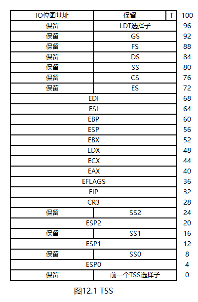
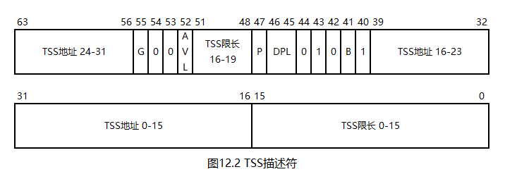

# 一个操作系统的设计与实现

# 第12章 任务（三）：3特权级任务

特权级是保护模式的核心概念之一，但我们的操作系统一直没有引入这个概念。这是因为，特权级只有在3特权级任务存在时才有意义。本章将要实现的是3特权级任务的加载与任务切换。

## 12.1 特权级

### 12.1.1 特权级的功能

特权级（Privilege Level），是保护模式中用于限制任务权限的机制。特权级有4级，分别是0\~3特权级。0特权级权限最大，供操作系统使用；3特权级权限最小，供普通任务使用。中间的两级在我们的操作系统中不使用。

特权级起到的作用如下：

1. **在不使用特殊机制的前提下**，禁止代码段寄存器切换特权级。也就是说，0特权级任务只能执行0特权级的代码，不能执行3特权级的代码；反之，3特权级任务只能执行3特权级的代码，不能执行0特权级的代码。这样，操作系统内部的代码就能得到保护，3特权级任务不能随意使用
2. **在任何情况下**，使用数据段寄存器只能访问平级或更低级的数据。也就是说，0特权级任务能够访问0特权级的数据，也能访问3特权级的数据；反之，3特权级任务只能访问3特权级的数据，不能访问0特权级的数据。这样，操作系统内部的数据就能得到保护，3特权级任务不能随意访问
3. EFLAGS的第12\~13位是IOPL（IO特权级）位，初值为0。只有特权级大于等于这两位，即数值上小于等于这两位的代码段才能执行`in`和`out`指令。在我们的操作系统中不修改这两位，因此，只有0特权级任务才有权限执行`in`和`out`指令。这样，IO端口就能得到保护，3特权级任务不能随意访问
4. 有少量非常关键的指令属于特权指令，这些指令**只有0特权级任务有权限执行**。在我们的操作系统中，特权指令包括以下几种：
   * `hlt`指令。显然，低特权级任务不能随意将CPU挂起
   * `sti`、`cli`指令，以及其他试图修改IF位的指令，如`popf`。低特权级任务不能关中断，否则抢占式任务切换就失效了
   * 试图修改IOPL的指令，如`popf`。低特权级任务不能修改IO特权级，否则对IO端口的保护机制就失效了
   * 任何试图读取或修改控制寄存器、GDTR、LDTR（局部描述符表，在我们的操作系统中未使用）、IDTR、TR（见下文）的指令。如`mov cr0, eax`、`lgdt`等。这些指令对CPU有重大影响，例如，修改CR0能开关保护模式和分页模式，这显然不能供低特权级任务随意使用
   * `invlpg`指令。低特权级任务不能干预TLB

### 12.1.2 DPL，RPL与CPL

特权级由三部分组成：描述符特权级（Descriptor Privilege Level，DPL），请求特权级（Requested Privilege Level，RPL）和当前特权级（Current Privilege Level，CPL）。DPL位于描述符中，如段描述符，中断门等；RPL是段选择子的低2位；**CPL恒等于CS的RPL**。

CPL决定了当前任务的执行权限。上文中的"只有0特权级任务有权限执行"、"3特权级任务只能访问3特权级的数据"等描述中的特权级，指的就是CPL。由于CPL恒等于CS的RPL，所以切换CS的过程，就是切换CPL的过程。

DPL决定了一个描述符的最低访问权限。向段寄存器加载段选择子时，CPU要求：在数值上，`CPL <= DPL && RPL <= DPL`。即，只有特权级平级，或更高级的指令才有权限访问此描述符。

RPL看上去是个没什么用的概念。如果没有RPL，CPL可以恒等于代码段的DPL；向段寄存器加载段选择子时，只需要`CPL <= DPL`即可。然而，RPL解决的是一个比较边缘的问题。设想：操作系统给3特权级任务提供了一个读硬盘函数，并要求3特权级任务提供数据段选择子以存放结果。此时，用户可以想办法猜到0特权级数据段选择子，并将其提供给操作系统，这样一来，3特权级任务就能读取0特权级数据了。虽然操作系统可以通过软件手段检测任务提供的段选择子是否可行，但这样做很麻烦且效率不高。给段选择子附加RPL后，即使3特权级任务故意把RPL写成0，操作系统也能在拿到段选择子后，强制将RPL改成3，再进行后续操作，从而将特权级检查交给CPU进行，即提高了效率，又比较方便。

正因为如此，CPL才由CS的RPL决定，而不是由代码段描述符的DPL决定。因为DPL只是一个最低标准，RPL才能描述真正的特权级。

### 12.1.3 特权级的提升

操作系统存在的意义是为3特权级任务提供服务，而不是死守自己的0特权级代码，不让任何人使用。上文提到，数据段在任何情况下都不能被低特权级任务访问，但代码段不同，操作系统可以将一部分函数开放给3特权级任务使用。

然而，操作系统的函数毕竟是0特权级的，3特权级任务想要使用这些函数，就需要有一套升降级机制，在调用0特权级函数之前先升级，调用完成后再降级。

对于这个需求，CPU提供的标准机制是调用门（Call gate），但这种机制要求为每个函数分别安装一个调用门，这是非常麻烦且效率低下的，所以，在我们的操作系统（以及几乎所有的现代操作系统）中都不使用这个机制。

事实上，中断门也有提升特权级的能力。因此，中断门可以用于向3特权级任务提供0特权级函数。具体步骤如下：

1. 发起一个中断
2. 检查`CPL <= DPL`（中断没有RPL）。如果通过，则允许任务进入中断门。**只有由指令发起的中断会进行这一步，外中断和CPU自己发起的中断无视中断门的DPL**
3. 检查`CPL >= 中断门中CS的RPL`，如果通过，则允许CS升级并调用中断门中的函数

综上，想要使用中断门，就必须满足两个条件：

1. 有权限进入中断门。这由中断门的DPL决定。这样做的目的是对3特权级任务能够使用的中断门进行限制
2. 进入中断门后，必须发生升级或平级，不允许降级

### 12.1.4 0特权级栈、TSS与TSS描述符

在特权级切换时，CPU还有一个特殊要求：SS的RPL必须时刻等于CPL。这意味着，每个3特权级任务必须有两个栈，分别供0特权级与3特权级使用。当特权级发生切换时，栈也要跟着切换。那么，这两个栈存放在哪呢？

CPU规定：0特权级栈需要放置在任务状态段（Task State Segment，TSS）中。TSS是一个至少为104字节（见下文）的表，结构如下：

TSS需要以TSS描述符的形式安装在GDT中。TSS描述符是系统段的一种，结构如下：

TSS描述符中的B位，即忙（Busy）位，由CPU在加载TSS时自动置1，构造TSS描述符时应将其置0。其他位的含义同段描述符。

与GDT、IDT类似，CPU也为TSS提供了一个专用寄存器。不过，这个寄存器不叫TSSR，而是叫任务寄存器（Task Register，TR）。在TSS描述符安装到GDT中以后，需要使用`ltr TSS描述符的选择子`指令将TSS加载到TR。TSS描述符的选择子可以存放在16位寄存器或内存中。

TSS（以及任务门，Task gate）是CPU提供的用于任务切换的标准机制，然而还是老问题：TSS使用起来非常麻烦，需要给每个任务都安装一个，且效率很低。所以，在我们的操作系统（以及几乎所有的现代操作系统）中都不使用这个机制。但TSS还有另一个功能，那就是获取任务的0特权级栈。具体来说，当中断发生时，引入特权级概念后的过程如下：

1. 检查CPL是否有权限进入中断门
2. 检查中断门中的CS是否能使CPL升级或平级
3. 如果中断门中的CS与CPL平级，跳过此步骤；否则，暂存SS和ESP，然后将SS和ESP分别切换为TSS中的SS0和ESP0，再将暂存的SS通过高位补0的方式填充至32位后压栈，接着将暂存的ESP压栈
4. 将EFLAGS压栈，然后将EFLAGS的IF位清零
5. 将CS通过高位补0的方式填充至32位后压栈
6. 将EIP压栈
7. 跳转至中断门中的中断处理函数

也就是说，虽然不使用TSS进行任务切换，但仍然需要一个TSS，其存在的唯一目的就是提供0特权级栈。

上文提到，TSS"至少为104字节"。这是因为TSS还能提供一个被称为IO位图的功能，这个位图延长在TSS后面，由TSS中的IO位图基址控制。IO位图用于越过IOPL，给特定的一些IO端口开白名单。在我们的操作系统中不使用IO位图，但也不能将其置0。CPU要求：如果IO位图基址的值大于等于TSS描述符中的TSS限长，则表示IO位图不存在。在我们的操作系统中，可将其置103（或`0xff`等更大的值）。

### 12.1.5 特权级的降低

3特权级任务能够通过中断门提升特权级，但这毕竟是暂时的。在中断处理函数调用完成后，就需要回到3特权级。

特权级的降低由`iret`指令实现。引入特权级概念后，该指令的执行过程如下：

1. 从栈中依次弹出EIP、CS、EFLAGS。如果弹出的CS的RPL为0，`iret`指令就此完成；否则，继续执行以下步骤
2. 依次检查DS、ES、FS、GS的RPL是否为3。如果不是，则将其修改为0。这一步的目的是：避免因中断返回使0特权级的段选择子泄漏到3特权级。GDT的第一个描述符必须为空的目的就在于此
3. 继续从栈中弹出ESP和SS，将栈恢复到3特权级栈。因此，TSS中不需要存放3特权级栈，3特权级栈的SS和ESP位于0特权级栈中

## 12.2 3特权级任务的实现原理

### 12.2.1 3特权级代码段与数据段

GDT中需要安装一个3特权级代码段描述符，和一个3特权级数据段描述符，以供3特权级任务使用。这两个描述符除了DPL为3外，其他属性与0特权级描述符相同。

### 12.2.2 TSS

GDT中需要安装一个TSS描述符，并使用`ltr`指令加载这个TSS。

### 12.2.3 3特权级任务的切换

3特权级任务的切换也基于时钟中断。但上一章中的"6个段寄存器不会发生改变"这一结论现在已经不成立了。所以，在时钟中断处理函数中，不仅需要将8个通用寄存器压栈，还需要将除了CS和SS以外的4个段寄存器压栈。

此外，由于每个任务都有一个ESP0，所以在任务切换时，需要修改TSS中的ESP0。SS0对于每个任务来说都是一样的，所以无需修改。

### 12.2.4 3特权级任务的创建

与0特权级任务类似，3特权级任务的创建也基于伪造栈技术。

现在，由于4个段寄存器也被压栈，对于0特权级任务来说，需要在栈上伪造15个寄存器的值；对于3特权级任务来说，需要在栈上伪造17个寄存器的值。

3特权级任务不仅需要0特权级栈，还需要3特权级栈。在我们的操作系统中，3特权级栈为一页，其虚拟地址固定为`0xc0000000`向下的`0x1000`字节。

### 12.2.5 3特权级任务的加载与重定位

3特权级任务往往不是操作系统的一部分，而是由用户提供的，存放在硬盘上的一个程序。从硬盘上加载程序可由硬盘驱动完成，解析ELF也不是难事，剩下的问题是：这个程序该如何重定位呢？

平坦模型失去了重定位能力，重定位由分页模式以一种完全不同的方式实现。具体来说，编译器可以为程序提供一套虚拟地址，只要虚拟地址落在任务地址空间内即可。操作系统在加载任务时，不主动分配虚拟地址，而是使用ELF文件提供的虚拟地址，并为这些虚拟地址分配物理地址，并安装PDE、PTE，然后，将ELF文件中的程序段展开到这些虚拟地址中。

## 12.3 3特权级任务的实现

### 12.3.1 添加3特权级描述符、TSS描述符

请看本章代码`12/Mbr.s`。

第143\~145行，定义了三个新的段描述符。分别是3特权级代码段描述符，段选择子是`(3 << 3) | 0x3`；3特权级数据段描述符，段选择子是`(4 << 3) | 0x3`；TSS描述符，段选择子是`5 << 3`。

TSS定义在内核中，在MBR中不知道其地址，所以，TSS描述符目前仅用于占位。

### 12.3.2 修改时钟中断处理函数

请看本章代码`12/Int.s`。

第3行，声明了外部链接的`printStr`函数。

第7行，声明了外部链接的TSS。TSS定义在本章代码`12/Task.hpp`中。

第108\~111行， 将四个数据段寄存器压栈。

第137\~138行，将TSS中的ESP0修改为新任务的ESP0。

第141\~144行，弹出新任务的四个数据段寄存器。

### 12.3.3 系统调用

上文提到，可以使用中断将0特权级函数提供给3特权级任务使用。这个方案看似需要很多中断号，但实际上有更好的设计：构造一个函数表，其中存放的是操作系统为3特权级任务提供的函数。然后，只使用一个中断，在中断处理函数中调用函数表中的函数，具体调用哪个函数由调用者通过一个索引值指定。上述操作被称为系统调用，调用者提供的索引值被称为系统调用号。

在我们的操作系统中，调用者应使用EAX存放系统调用号；EBX、ECX、EDX用于存放参数（如果有）。在系统调用的中断处理函数中，不管有几个参数，都将EBX、ECX、EDX压栈，然后使用EAX找到一个函数并调用。

请看本章代码`12/Int.s`。

`intSyscall`是系统调用的中断处理函数。

第150\~152行，不管实际需要几个参数，都将EBX、ECX、EDX压栈。

第153行，使用EAX中存放的系统调用号调用`[syscallList + eax * 4]`这个函数。

第154行，将栈恢复。

第156行，使用`iret`指令从中断返回。

第210行，在`intList`的最后添加`intSyscall`函数。现在的IDT扩充至49个中断门，系统调用的中断号是`0x30`。

第212\~213行，定义系统调用表。目前只支持一个系统调用：`printStr`函数，其系统调用号为0。

接下来，请看本章代码`12/Int.hpp`。

第7行，将IDT的大小修改为49。

第25行，将`intSyscall`函数安装到IDT中。注意：由于系统调用是给3特权级任务使用的，所以中断门的DPL必须为3，这样3特权级任务才有权限使用这个中断门。

### 12.3.4 内存管理系统的修改

请看本章代码`12/Memory.h`。

第9行，声明了`installTaskPage`函数。

接下来，请看本章代码`12/Memory.hpp`。

`installTaskPage`函数是本章新增的函数，其用于在指定的虚拟地址处分配物理地址，并将虚拟地址与物理地址建立联系。所以，这个函数相当于`__allocatePage`函数的简化版。

第85行，从TCB中取得当前任务的虚拟地址位图，接下来需要手动设置这个位图。

第87行，判断虚拟地址是否超出了位图范围。进行这个判断的原因是，这个函数不仅用于安装ELF文件中的地址，这些地址都很接近0；还用于安装3特权级栈，地址是`0xc0000000 - 0x1000`，这个地址远远超过了一页位图能表示的128M内存，所以，此时无需设置位图。

第89\~92行，根据虚拟地址设定位图中已使用的位。

第95\~100行，为虚拟地址的每一页安装物理地址。这段代码的实现原理和第66\~71行一致。

### 12.3.5 0特权级任务加载器的修改

请看本章代码`12/Task.hpp`。

由于任务切换时添加了4个段寄存器的压栈，所以伪造栈的过程也要随之修改。

第96行，将原先的`11 * 4`修改为`15 * 4`。

第108\~114行，重新调整栈上伪造的数据。

### 12.3.6 安装并加载TSS

请看本章代码`12/Task.h`。

第16行，声明了外部链接的TSS。

接下来，请看本章代码`12/Task.hpp`。

第10行，定义了TSS，但暂时没有初始化。

`__makeTSSDescriptor`函数用于构造TSS描述符。

读者要格外小心这个函数的实现，例如"TSS地址的最高8位"，从TSS描述符的结构图上看，其位于第56\~63位，但如果实现为`(tssBase & 0xff000000) << 56`，那就完全错了。`tssBase & 0xff000000`得到的这个数字相当于已经左移了24位，所以，只需要再左移32位即可。

`__installTSS`函数用于安装TSS。

第23\~24行，初始化TSS中的SS0与IO位图基址。内核用不到ESP0，所以无需初始化。

第28行，使用`sgdt`指令获取GDTR。

第30行，在GDT中安装TSS描述符。

第32行，重新加载GDT。此时，TSS的段选择子`5 << 3`可用。

第33行，使用`ltr`指令加载TSS。

第51行，在`taskInit`函数中添加对`__installTSS`函数的调用。

### 12.3.7 3特权级任务的加载

请看本章代码`12/Task.h`。

第23行，声明了`loadTaskPL3`函数。

接下来，请看本章代码`12/Task.hpp`。

`loadTaskPL3`函数是本章新增的函数，其用于加载3特权级任务。

不同于`loadTaskPL0`函数，`loadTaskPL3`函数的参数是硬盘的起始扇区号与扇区数。所以，此函数可以一步到位的从硬盘上加载3特权级任务。

第124\~136行，与`loadTaskPL0`函数的开头部分一致。用于分配新任务的TCB，CR3，以及虚拟地址位图，并设置好新的CR3。

第138行，将扇区数转换为页数。这里使用了以下公式：

$$
\lceil \frac{a}{b} \rceil =\lfloor \frac{a\,\,+\,\,b\,\,-\,\,1}{b} \rfloor
$$
第139行，分配ELF缓冲区。

第141行，调用硬盘驱动中的读硬盘函数，将任务从硬盘读取到缓冲区。

第143\~145行，读取ELF文件头中的3个信息：程序头表地址，程序头表中每个表项的大小，以及程序头表中表项的数量。

第147\~154行，保存当前的CR3，并将其暂时切换到新任务的CR3上。这里的内联汇编使用了第6章讨论的独占约束`"=&r"`。这一步的目的是：任务加载到的虚拟地址属于任务自己的地址空间，所以，应在任务的CR3中分配内存。

第156行，遍历程序头表中的每个表项。

第158行，判断当前表项的类型，只关注类型为1的表项。

第160行，从表项中读取源地址。

第161行，从表项中读取目的地址。

第163行，将ELF要求的内存大小向上取整到页数。这里使用了上文中的公式。

第165行，使用`installTaskPage`函数在ELF要求的加载地址处安装页。

第167\~168行，加载程序段并构造BSS段。

第172行，从ELF文件头中读取任务的入口点。

至此，ELF已经加载完毕。

第174行，回收ELF缓冲区。这里虽然使用的是任务的CR3，但内核地址空间是共享的，只要有权限，任何CR3都能分配和回收内核页。

第176\~196行，伪造3特权级任务的0特权级栈，一共需要伪造17个寄存器的值。

第198行，为3特权级栈安装物理页。

第200\~204行，将CR3换回。

第206\~208行，初始化新任务的虚拟地址位图，然后将其添加到任务队列中。这两行代码与`loadTaskPL0`函数中的一致。

## 12.4 测试

请看本章代码`12/Test.c`。

这个任务现在运行在3特权级下，所以其没有权限使用操作系统中的所有函数，唯一能用的是0号系统调用。使用系统调用还有一个好处：由于系统调用是中断，而中断过程中不会发生任务切换，所以系统调用是自带锁的。

第5\~9行，在循环中不断发起0号系统调用，打印`Task`字符串。

由于我们的操作系统目前仍然不支持任务回收，所以任务不能退出。

接下来，请看本章代码`12/Makefile`。

第6行，编译`Test.c`。

第8行，链接`Test.o`。

对于`ld`命令来说，如果不设定`-Ttext-segment`参数，则任务的默认加载地址为`0x8048000`。我们不需要也不能使用这么大的加载地址，因为这个数字甚至超过了128M。因此，链接`Test.o`时需要加上`-Ttext-segment 0`参数。

第11行，将`Test`写入虚拟硬盘。

接下来，请看本章代码`12/Kernel.c`。

第15\~16行，将测试任务加载两次。

第22\~26行，在循环中不断发起0号系统调用，打印`Kernel`字符串。这样做有两个目的：

1. 利用系统调用自带锁这一性质
2. 观察中断门的平级调用

## 12.5 调试

本章的任务运行在3特权级下，因此，如果想要手动进行任务切换以调试程序，就需要将`__installIDT`函数中的`0x8e00`临时修改为`0xee00`，使得3特权级任务也能进入`0x20`中断门。

在bochs调试器中，TSS可以通过`info tss`命令查看。

