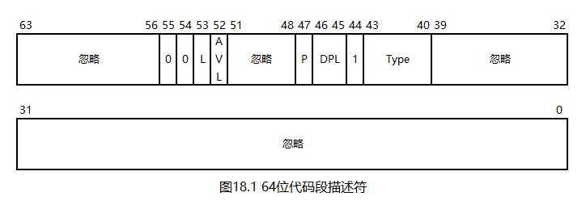

# 一个操作系统的设计与实现

# 第18章 IA32-e模式

我们已经实现了一个运行在保护模式下的操作系统，然而，如今早已是64位多核操作系统的时代，而我们的操作系统仅仅是一个32位单核操作系统。因此，从本章开始，我们将在32位单核操作系统的基础上，将其升级为一个64位多核操作系统。

## 18.1 64位寄存器

64位CPU的通用寄存器宽度是64位的，不仅如此，其还新增了8个通用寄存器`R8 ~ R15`，并拓展了现有寄存器的用法：现在，所有的寄存器都有8、16、32、64位版本。这些寄存器如下表所示：

| 64位版本 | 32位版本 | 16位版本 | 8位版本 |
| -------- | -------- | -------- | ------- |
| RAX      | EAX      | AX       | AL/AH   |
| RBX      | EBX      | BX       | BL/BH   |
| RCX      | ECX      | CX       | CL/CH   |
| RDX      | EDX      | DX       | DL/DH   |
| RSI      | ESI      | SI       | SIL     |
| RDI      | EDI      | DI       | DIL     |
| RBP      | EBP      | BP       | BPL     |
| RSP      | ESP      | SP       | SPL     |
| R8       | R8D      | R8W      | R8B     |
| R9       | R9D      | R9W      | R9B     |
| R10      | R10D     | R10W     | R10B    |
| R11      | R11D     | R11W     | R11B    |
| R12      | R12D     | R12W     | R12B    |
| R13      | R13D     | R13W     | R13B    |
| R14      | R14D     | R14W     | R14B    |
| R15      | R15D     | R15W     | R15B    |

64位寄存器有一个特殊设定：当向一个32位寄存器传送时，其高32位将被自动清零。也就是说，不需要也不存在这样的指令：`movzx 64位寄存器, 32位寄存器`；然而，`movsx 64位寄存器, 32位寄存器`与此设定不矛盾，故仍然存在。

标志寄存器已拓展至64位，被称为RFLAGS。然而，由于其低32位都还没用完，所以拓展出的高32位均为保留位。

指令指针寄存器已拓展至64位，被称为RIP。

## 18.2 64位立即数

由于机器语言层面的限制，CPU对64位立即数的支持非常差，以至于只需要以下规则就能描述：

* `mov 64位寄存器, 64位立即数`是**唯一支持64位立即数的指令**
* 其他指令如果强行使用64位立即数，也只会取其低32位

也就是说，很多依赖立即数的指令，如内存访问，加减法，位运算等，都不能使用64位立即数，而是需要先使用`mov`指令进行周转。

## 18.3 RIP相对寻址

64位CPU新增了一种内存访问模式，被称为RIP相对寻址。具体来说：在nasm语法中，`[标号]`和`[abs 标号]`表示的是普通的内存寻址模式，此时，标号的值就是内存地址；`[rel 标号]`表示的是新增的RIP相对寻址，此时，该指令会被编译器转换为`[rip + 标号相对于rip的偏移量]`。这样做的好处在于：64位模式下，标号很有可能是一个超过32位的地址，不过，由于标号往往离RIP比较近，相对偏移量较小，故不会超过32位的限制。在nasm中，可以通过声明`[default rel]`将所有的`[标号]`都视为`[rel 标号]`。

需要注意的是，RIP相对寻址只适用于`[标号]`这种形式，其他形式，如：`[寄存器 + 标号]/[64位立即数]`等，都是不适用于RIP相对寻址的，这是因为这些指令都无法确定地址与RIP的相对偏移量。

## 18.4 64位段描述符和GDT

在32位操作系统中，我们使用的是平坦模型而非分段模型，从而，段基址和段限长均成了摆设。在64位模式下，分段模型被CPU彻底淘汰，转而固定使用平坦模型。

64位代码段描述符如下图所示：

如图所示，由于固定使用平坦模型，段描述符中的段基址、段限长、粒度等字段均被忽略或固定为0，只剩下存在位、描述符类型、DPL等字段。

段描述符的第53位为L位，在保护模式中，这一位是保留位，其正是为64位模式准备的。如果这一位为1，则表示这是一个64位模式下的段描述符。

对于数据段，DS、ES、SS均被直接忽略，FS、GS的段基址可由特殊方法设定，其他信息，如段限长等被忽略，这里的"特殊方法"将在后续章节中讨论。然而，在实际测试中笔者发现：bochs中的某些指令，如`iretq`等，并不会忽略数据段描述符，这可能是bochs的bug。所以，在我们的操作系统中仍然需要定义数据段描述符。

64位模式下的GDTR仍然使用16位的表限长，但表的起始地址拓展到64位，也就是说，GDTR的大小为10字节。

## 18.5 PAE模式

在保护模式中，一个页表或页目录表的大小都是一页，其中存放了1024个32位的地址，需要一个10位的二进制数作为其索引值。此时，如果将地址的宽度拓展到64位，且表的大小不变，则一个表中能存放的地址数量就会减少到512个，只需要一个9位的二进制数作为其索引值。

考察二级分页模式的虚拟地址，其由两个10位的索引值和一个12位的页内偏移量组成。如果使用上述方法将索引值减少到9位，虚拟地址就空出了两位，这两位可以构成第三个索引值，从而将虚拟地址拓展到4个部分。这种分页模式被称为PAE（Physical-Address Extension，物理地址扩展）模式。PAE模式的第三个索引值只有两位，只能用于一个长度为4的表，这个表被称为页目录指针表（Page Directory Pointer Table，PDPT），其中的表项被称为页目录指针项（Page Directory Pointer Table Entry，PDPTE）。PDPT是PAE模式的起点，其物理地址需要安装到CR3中。PDPTE的存在位、权限位等与PDE/PTE相同。

PAE模式是32位虚拟地址到64位物理地址的映射，所以，虽然虚拟地址还是32位的，只能表示4G内存，但通过反复切换CR3中的PDPT，（理论上）就能访问到整个64位物理地址空间了。

## 18.6 四级和五级分页模式

PAE模式明显是个很别扭的过渡产物，在64位CPU中，虚拟地址拓展到了64位，此时，可以将虚拟地址拆成`12 + 9 + 9 + 9 + 9 + 9 + 7 == 64`位，从而构造出六级分页模式。然而，64位地址所能表示的地址范围远远超过了目前物理内存的实际大小，所以，出于成本和运行效率考虑，目前的CPU只支持四级和五级分页模式。

四级和五级分页模式中新增的表被称为四级页表（Page Map Level 4，PML4）和五级页表（Page Map Level 5，PML5），其中的表项被称为四级页表项（Page Map Level 4 Entry，PML4E）和五级页表项（Page Map Level 5 Entry，PML5E）。PML4E、PML5E的存在位、权限位等与PDE/PTE相同。

IA32-e模式必须使用四级或五级分页模式，因此，我们的操作系统使用四级分页模式。PML4作为四级分页模式的起点，其物理地址需要安装到CR3中。

四级分页模式只使用`12 + 9 + 9 + 9 + 9 == 48`位虚拟地址，对于剩余的高位，CPU要求：**虚拟地址的高16位必须和第47位一致**，满足此要求的地址被称为规范地址（Canonical Address）。如果使用不规范的地址，CPU会抛出异常。

考察规范地址，可以发现其由以下两部分组成：

* `0x0000_0000_0000_0000 ~ 0x0000_7fff_ffff_ffff`
* `0xffff_8000_0000_0000 ~ 0xffff_ffff_ffff_ffff`

这两段地址的范围一样，并且都很大，因此，自然的适用于划分内核地址空间与任务地址空间，我们的操作系统正是这么做的。

在四级或五级分页模式下，如果将PDE的第7位置1，则可打开2M大页模式。此时，PDE不再指向页表，而是直接指向一个2M大页的起始地址，由虚拟地址中剩余的21位构成页内偏移量。在我们的操作系统中，这个功能被多次使用。

## 18.7 进入IA32-e模式

硬件需要保持兼容性，因此，即使是64位的CPU，也要和以前一样，从实模式开始，先进入保护模式，再进入64位模式。

64位模式是个统称，其有两个子模式：兼容模式和IA32-e模式。兼容模式可在不回退到保护模式的前提下执行保护模式的代码，其也用于保护模式到IA32-e模式的过渡；IA32-e模式即为真正的64位模式。

想要进入IA32-e模式，就需要先进入保护模式，但无需打开二级分页模式。然后，通过以下步骤进入IA32-e模式：

1. 安装四级分页模式所需的所有表，并将PML4的物理地址安装到CR3
3. 将CR4的第5位置1，这一步用于打开PAE模式
4. 将IA32_EFER的第8位置1，这一步用于打开IA32-e模式。这一步的实现细节将在下文中讨论
5. 将CR0的第31位置1，打开四级分页模式
6. 跳转到64位代码段

请看本章代码`18/Boot.inc`。

第4\~5行，定义了抬升后的MBR的段基址和物理地址。请注意：地址的取值与32位操作系统不同，这是因为`[0x9d000 ~ 0xa0000)`这段内存有其他用途，见下文。

接下来，请看本章代码`18/Mbr.s`。

第5\~37行，进入保护模式。

第39\~45行，将`[0x9d000, 0x9f000)`和`[0x100000, 0x200000)`这两段内存清零。这些内存的用途如下表所示：

| 地址                   | 作用                         |
| ---------------------- | ---------------------------- |
| `[0x9d000, 0x9e000)`   | 低端2M内存使用的页目录表     |
| `[0x9e000, 0x9f000)`   | 保留给后续章节使用的页目录表 |
| `[0x100000, 0x101000)` | PML4                         |
| `[0x101000, 0x200000)` | 内核地址空间的255个PDPT      |

第47行，安装第一个PML4E，其用于过渡到分页模式，不与其他任务共享。

第49\~58行，安装内核地址空间的255个PML4E。内核地址空间平分了一半的虚拟地址，所以应该有256个PML4E，但最后一个PML4E指向PML4本身，所以不参与循环。预先安装255个PML4E的目的是共享内核，其原理与二级页表一致，这里不再赘述。

第60行，安装最后一个PML4E，其指向PML4本身。这样做的目的是为内存管理做准备，其原理与二级页表一致，这里不再赘述。

第61行，在内核地址空间的第一个PDPT中安装第一个PDPTE，其指向`0x9d000`处的页目录表。

第62行，在`0x9d000`处的页目录表中安装第一个PDE，其指向起始地址为0的2M大页。我们的操作系统内核只使用2M物理内存，刚好可以被一个2M大页覆盖。

第64\~65行，将PML4的物理地址安装到CR3中。

第67\~69行，将CR4的第5位置1，打开PAE模式。

第71\~74行，将IA32_EFER的第8位置1，打开IA32-e模式。

IA32_EFER是一个型号特定寄存器（Model-Specific Register，MSR），这里的EFER即扩展功能启用寄存器（Extended Feature Enable Register）。型号特定指的是仅在部分型号的CPU上才有，例如IA32_EFER在不支持IA32-e模式的CPU上可能就是没有的。MSR有很多个，以至于难以对其进行命名，所以，诸如IA32_EFER这样的名字只是方便书面记录，不能用在代码中，代码中实际使用的是MSR的编号，并使用`rdmsr/wrmsr`指令对其进行读写。具体来说：

* `rdmsr/wrmsr`固定使用ECX设定MSR的编号
* 每个MSR都是64位的，`rdmsr/wrmsr`固定使用EDX:EAX读写MSR
* IA32_EFER的编号是`0xc0000080`

第76\~78行，打开分页模式。

第80行，跳转到64位代码段。

第82行，将后续代码以64位模式编译。

第86行，重新加载GDTR。在64位模式下，`lgdt`指令会读取10字节的内存，所以，重新加载GDTR可将GDT抬升到高地址。

第88行，将RSP抬升到高地址。

第90行，挂起CPU。

第92\~97行，定义GDT。GDT中的表项如下：

0. 空
1. 保护模式0特权级代码段
2. 保护模式0特权级数据段
3. IA32-e模式0特权级代码段

第99\~102行，定义GDTR。GDTR会被加载两次，第一次只使用前6字节，第二次则使用完整的10字节。

第104\~106行，填充MBR并设定MBR魔数。

## 18.8 编译与测试

本章代码`18/Makefile`编译了MBR。

启动bochs，可以观察到操作系统已经进入无限循环状态。

至此，我们已经进入IA32-e模式，接下来，就可以加载内核了。

