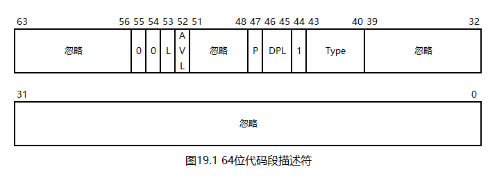

# 一个操作系统的设计与实现

# 第19章 IA32-e模式

## 19.1 64位段描述符与GDT

在32位操作系统中，我们使用的是平坦模型而非分段模型，从而，段描述符的段基址和段限长均成了摆设。在64位模式下，就连CPU也淘汰了分段模型，转而固定使用平坦模型。

64位代码段描述符如下图所示：

如图所示，由于固定使用平坦模型，段描述符中的段基址、段限长、粒度等位均被忽略或固定为0，此时的段描述符不再提供段基址，只能提供其是否存在、描述符类型、DPL等信息。

段描述符的第53位为L位，在保护模式中，这一位是段描述符中唯一的保留位，其正是为64位模式准备的，作用如下：

* 如果这一位为0，段描述符是32位的
* 否则，如果这一位为1，段描述符是64位的

对于数据段，`ds`、`es`、`ss`均直接被忽略，`fs`、`gs`的段基址可由特殊方法设定，其他信息，如段限长等亦被忽略。这里的"特殊方法"将在后续章节中讨论。然而，在实际测试中笔者发现：在`bochs`中，某些指令，如`iretq`等，并不会忽略数据段描述符，这可能是`bochs`的bug。因此，在我们的操作系统中仍然需要定义数据段描述符。

64位模式下的GDT仍然使用16位的表限长，但表的起始地址拓展到64位，也就是说，GDTR现在由一段`2 + 8 == 10`字节的内存组成。

## 19.2 三级分页模式

一个页表或页目录表的大小都是一页，其中存放了1024个32位的地址，需要一个10位的二进制数作为其索引值。现在，如果将地址的宽度拓展到64位，表的大小不变，则一个表中能存放的地址数量就减少到512个，只需要一个9位的二进制数作为其索引值。

考察二级分页模式的虚拟地址，其由两个10位的索引值和一个12位的页内偏移量组成。如果使用上述方法将索引值减少到9位，虚拟地址就空出了两位，这两位可以构成第三个索引值，从而将分页层级扩展到三级。这种分页模式，就称为PAE（Physical-Address Extension，物理地址扩展）模式，或通俗的称为三级分页模式。

三级分页模式的第三个索引值只有两位，只能用于一个长度为4的表，这个表就称为页目录指针表（Page Directory Pointer Table，PDPT），其中的表项就称为页目录指针项（Page Directory Pointer Table Entry，PDPTE）。PDPT是三级分页模式的起点，其物理地址需要安装到`cr3`中。PDPTE的存在位、权限位等与PDE/PTE相同。

三级分页模式是32位虚拟地址到64位物理地址的映射，因此，虽然虚拟地址还是32位的，只能表示4G内存，但通过反复切换`cr3`中的PDPT，（理论上）就能访问到整个64位物理地址空间了。

## 19.3 四级与五级分页模式

三级分页模式明显是个很别扭的过渡产物，在64位CPU中，虚拟地址也拓展到了64位，此时，可以将虚拟地址拆成`12 + 9 + 9 + 9 + 9 + 9 + 7 == 64`位，从而构造出六级分页模式。然而，这样的地址实在是太大了，远远超过了目前物理内存的实际大小，因此，出于成本和运行效率考虑，目前的CPU只支持四级或五级分页模式。

四级与五级分页模式中新增的表不再沿用PDPTE这样别扭的名称，而是简单的称为四级页表（Page Map Level 4，PML4）与五级页表（Page Map Level 5，PML5），其中的表项就称为四级页表项（Page Map Level 4 Entry，PML4E）与五级页表项（Page Map Level 5 Entry，PML5E）。PML4E、PML5E的存在位、权限位等与PDE/PTE相同。

IA32-e模式必须使用四级或五级分页模式，因此，我们的操作系统使用四级分页模式。PML4作为四级分页模式的起点，其物理地址需要安装到`cr3`中。

四级分页模式只使用`12 + 9 + 9 + 9 + 9 == 48`位虚拟地址，对于剩余的高位，CPU要求：**虚拟地址的高16位必须与第47位一致**，满足此要求的地址被称为规范地址（Canonical Address）。如果使用不规范的地址，CPU会抛出异常。

考察规范地址，可以发现其由以下两部分组成：

* `0x0000_0000_0000_0000 ~ 0x0000_7fff_ffff_ffff`
* `0xffff_8000_0000_0000 ~ 0xffff_ffff_ffff_ffff`

这两段地址的范围一样，并且都很大，因此，自然的适用于划分内核地址空间与任务地址空间，我们的操作系统正是这么做的。

在四级或五级分页模式下，如果将PDE的第7位置1，则可打开2M大页模式。此时，PDE不再指向页表，而是直接指向一个2M大页的起始地址，由虚拟地址中剩余的`12 + 9 == 21`位构成页内偏移量。在我们的操作系统中，这个功能被多次使用。

## 19.4 进入IA32-e模式

硬件需要保持兼容性，因此，即使是64位的CPU，也要和以前一样，从实模式开始，先进入保护模式，再进入64位模式。

64位模式是个统称，其有两个子模式：兼容模式与IA32-e模式。兼容模式可在不回退到保护模式的前提下执行保护模式的代码，其也用于保护模式到IA32-e模式的过渡；IA32-e模式即为真正的64位模式。

想要进入IA32-e模式，就需要先进入保护模式，但无需打开二级分页模式。然后，通过以下步骤进入IA32-e模式：

1. 安装四级分页模式所需的所有表，并将PML4的物理地址安装到`cr3`
3. 将`cr4`的第5位置1，这一步用于打开PAE模式，从而将页表中的地址视为64位的
4. 将`IA32_EFER`的第8位置1，这一步用于打开IA32-e模式。这一步的实现细节将在下文中讨论
5. 将`cr0`的第31位置1，打开四级分页模式
6. 跳转到64位代码段

请看本章代码`19/Mbr.s`：

第1~24行，进入保护模式。

第26~33行，将`[0x100000, 0x200000)`和`[0x90000, 0x92000)`这两段内存清零。这些内存的用途如下表所示：

| 地址                   | 作用                         |
| ---------------------- | ---------------------------- |
| `[0x100000, 0x101000)` | PML4                         |
| `[0x101000, 0x200000)` | 内核地址空间的255个PDPT      |
| `[0x90000, 0x91000)`   | 低端2M内存使用的页目录表     |
| `[0x91000, 0x92000)`   | 保留给后续章节使用的页目录表 |

第35行，安装第一个PML4E，其用于过渡到分页模式，不与其他任务共享。

第37~46行，安装内核地址空间的255个PML4E。内核地址空间平分了一半的虚拟地址，因此本应有256个PML4E，但最后一个PML4E指向PML4本身，因此不参与循环。预先安装255个PML4E的目的是共享内核，其原理与二级页表一致，这里不再赘述。

第48行，安装最后一个PML4E，其指向PML4本身。这样做的目的是为内存管理做准备，其原理与二级页表一致，这里不再赘述。

第49行，在内核地址空间的第一个PDPT中安装第一个PDPTE，其指向`0x90000`处的页目录表。

第50行，在`0x90000`处的页目录表中安装第一个PDE，其指向起始地址为0的2M大页。我们的操作系统只使用2M物理内存，刚好可以被一个2M大页覆盖。

第52~53行，将PML4的物理地址安装到`cr3`中。

第55~57行，将`cr4`的第5位置1，打开PAE模式。

第59~62行，将`IA32_EFER`的第8位置1，打开IA32-e模式。

`IA32_EFER`是一个型号特定寄存器（Model-Specific Register，MSR），这里的EFER即扩展功能启用寄存器（Extended Feature Enable Register）。型号特定指的是仅在部分型号的CPU上才有，例如`IA32_EFER`在不支持IA32-e模式的CPU上可能就是没有的。MSR有很多个，以至于难以对其进行命名。因此，诸如`IA32_EFER`这样的名字只是方便书面记录，不能用在代码中，代码中实际使用的是MSR的编号，并使用`rdmsr/wrmsr`指令对其进行读写。具体来说：

* `rdmsr/wrmsr`固定使用`ecx`设定MSR的编号
* 每个MSR都是64位的，`rdmsr/wrmsr`固定使用`edx:eax`组合描述它
* `IA32_EFER`的编号是`0xc0000080`

第64~66行，打开分页模式。

第68行，跳转到64位代码段。

第70行，将后续代码以64位模式编译。

第74行，重新加载GDTR。在实模式下，`lgdt`会读取6字节的内存，而在64位模式下，`lgdt`指令会读取10字节的内存，因此，重新加载GDTR可将GDT抬升到高地址。

第76行，将`rsp`抬升到高地址。

第78行，挂起CPU。

第80~87行，定义GDT。0号表项为空表项，这是GDT的要求；1~2号表项分别为保护模式下的0特权级代码段与数据段；3~4号表项分别为64位0特权级代码段与数据段；5~6号表项分别为64位3特权级数据段与代码段。4~6号表项在本章中未使用，保留给后续章节使用。细心的读者会发现：3~4号表项是先代码段，后数据段；但5~6号表项是先数据段，后代码段，这种别扭的写法是有意而为之的，将在后续章节中讨论。

第89~92行，定义GDTR。GDTR会被加载两次，第一次只使用前6字节，第二次则会使用完整的10字节。

第94~96行，填充MBR并设定MBR魔数。

## 19.5 编译与测试

请看本章代码`19/Makefile`。

第2行，使用`dd`命令创建一个虚拟硬盘，这比使用`bximage`命令更方便。

第3~4行，编译MBR，并将其写入虚拟硬盘的0号扇区。

启动`bochs`，可以观察到操作系统已经进入无限循环状态。

至此，我们已经进入IA32-e模式，接下来，就可以加载内核了。

