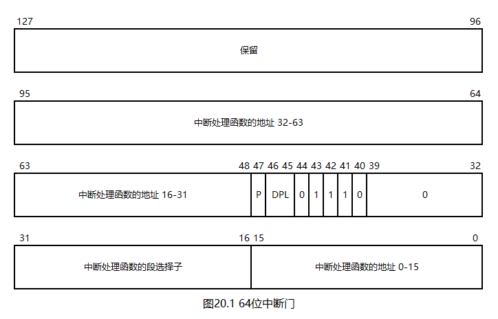

# 一个操作系统的设计与实现

# 第20章 高级可编程中断控制器

## 20.1 什么是高级可编程中断控制器

我们已经使用过型号为8259A的可编程中断控制器（Programmable Interrupt Controller，PIC）。在单CPU计算机中，中断的处理相对简单：所有的外设和CPU都连接在PIC上即可。然而，如果计算机中有不止一个CPU，仍然这样连接就会产生问题，例如：

* 键盘中断会被每个CPU分别接收一次，这是错误的
* 时钟中断会统一广播给各个CPU，这样做虽然没有错误，但降低了灵活性

高级可编程中断控制器（Advanced Programmable Interrupt Controller，APIC）用于解决上述问题。顾名思义，APIC是PIC的升级版，其要点如下：

* 由于每个CPU需要独立接收中断，尤其是时钟中断，于是可以给每个CPU分别安装一个中断控制器，这些APIC被称为本地APIC（Local APIC，LAPIC）。并且，每个LAPIC中都安装了独立的定时器
* 由于外设产生的中断信号不能广播到每个CPU上，于是可以再为外设专门准备一个中断控制器，这个APIC被称为IO APIC
* 任意两个APIC之间都可以通信

需要注意的是：PIC和APIC在计算机中是并存的，且均和CPU连接。如果要使用APIC，就需要屏蔽PIC的所有信号。IO APIC的所有信号在默认状态下都是屏蔽的。

## 20.2 APIC内存映射

APIC使用内存映射而非IO端口进行通信，这类似于显卡。具体来说：

* LAPIC的内存映射起始地址为`0xfee00000`，大小为2M
* IO APIC的内存映射起始地址为`0xfec00000`，大小为2M
* APIC中的每个寄存器都是32位的

这两个地址均为物理地址，因此，想要在分页模式下使用APIC，就需要为这两个物理地址安装虚拟地址映射。由于需要映射的地址范围均为2M，所以刚好可以使用2M大页模式。此外，CPU要求这些地址映射是禁用缓存的，将各类页表项的第4位置1即可禁用缓存。

综上，在我们的操作系统中，APIC内存映射的实现如下：

* 将`0xfec00000`映射到`0xffff8000fec00000`，使用2M大页模式，禁用缓存
* 将`0xfee00000`映射到`0xffff8000fee00000`，使用2M大页模式，禁用缓存

## 20.3 LAPIC定时器

LAPIC定时器可向其对应的CPU发送时钟中断信号，其通过三个内存地址进行设定：

1. `0xfee00320`：固定设为`0x20000 | 时钟中断向量号`。在我们的操作系统中，时钟中断向量号为`0x20`
2. `0xfee003e0`：设定分频器。在我们的操作系统中，固定设为`0xb`，表示1分频。这里的1表示CPU每经过1个时钟周期，定时器的值就会减1，也就是说，如果将这个1改成比较大的数字，定时器就会变慢，从而能够记录更长的时间
3. `0xfee00380`：设定定时器的初始值。在我们的操作系统中，固定设为`0xffff`。当定时器的值降为0时，就会触发一次时钟中断，然后将定时器重置到初始值。也就是说，定时器的初值越小，时钟中断的触发频率就越高

## 20.4 LAPIC中断响应信号

和8259A一样，中断处理函数需要向LAPIC发送中断响应信号，向`0xfee000b0`写入0即可。

## 20.5 64位中断门和IDT

中断门中存放着中断处理函数的地址，因此，在64位模式下，中断门需要拓展，以存放64位的地址。这一拓展是非常直接的，如下图所示：

如图所示，64位中断门只需要在32位中断门的基础上增加8字节即可，其中，前4字节是中断处理函数的高32位，后4字节是0。

64位模式下的IDTR和GDTR一样，由2字节的表限长和8字节的表地址组成。

## 20.6 64位中断

64位中断的发生过程与32位中断基本一致，但有一个很重要的区别：无关乎特权级是否改变，中断发起时都会依次压栈SS，RSP，RFLAGS，CS，RIP，且中断返回时会出栈这五个寄存器。

## 20.7 打开时钟中断

请看本章代码`20/Mbr.s`。

第61行，为APIC安装PDPTE，其指向`0x9e000`处的页目录表。

第64\~65行，为APIC安装PDE，使用2M大页模式，并禁用缓存。

以上代码中使用的`0x101018`、`0x9efb0`、`0x9efb8`这些地址，均可使用计算器计算得到，这里不再赘述。

接下来，请看本章代码`20/Int.hpp`。

第9行，定义了IDT。每个中断门的大小为16字节。

`__picInit`函数用于屏蔽8259A主片的所有信号。由于从片是接在主片的2号接口上的，故从片也会被屏蔽。

`__apicInit`函数用于设定LAPIC定时器。

`__makeIntGate`函数用于构造64位中断门。读者要小心`(RIP & 0xffff0000) << 32`，不能写成`(RIP & 0xffff0000) << 48`，这是因为`RIP & 0xffff0000`得到的数字相当于已经左移了16位，所以，只需要再左移32位即可。

`__idtInit`函数用于安装IDT和IDTR。

`intInit`函数用于初始化中断系统。

接下来，请看本章代码`20/Int.s`。

第9\~43行，定义了64位版本的`pusha/popa`指令，CPU没有提供这两个指令的64位版本。

`__intUnknown`是默认中断处理函数。

`__intTimer`是时钟中断处理函数。

第53\~54行，向LAPIC发送中断响应信号。

第56\~57行，打印数字6。

第61行，从中断返回。请注意：这里不能写成`iret`，这是因为`iret`和`iretq`指令在64位模式中是并存的，前者用于返回到兼容模式代码段。

时钟中断处理函数压栈、出栈所有的通用寄存器是为任务切换做准备。64位模式下数据段寄存器已经没有用了，故无需压栈。

## 20.8 编译与测试

本章代码`20/Makefile`新增了`Int.s`的编译与链接命令。

本章代码`20/Kernel.c`测试了时钟中断。

