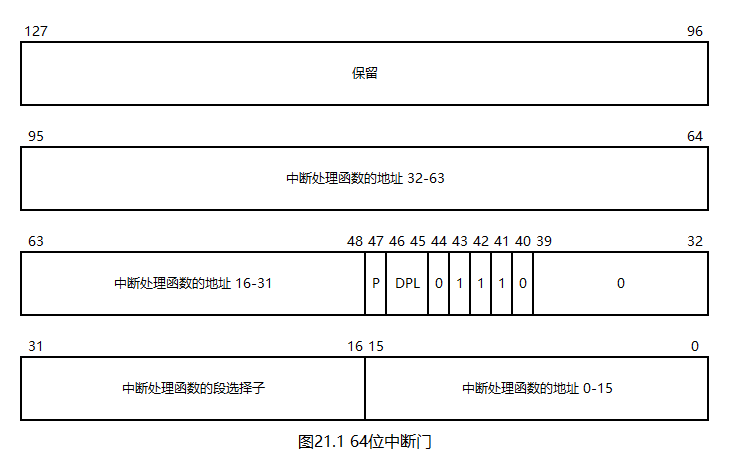
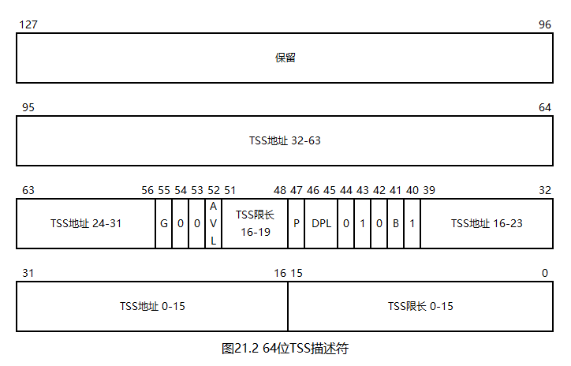

# 一个操作系统的设计与实现

# 第21章 64位任务

## 21.1 64位TSS与TSS描述符

想要实现任务，就需要先安装好TSS和TSS描述符。

64位TSS如下图所示：

如图所示，64位TSS的大小不变，还是104字节。64位CPU淘汰了硬件任务切换和数据段寄存器，因此，64位TSS的组成与32位TSS完全不同，其已不具备保存寄存器的功能，其中的大部分字节用于中断栈表（Interrupt Stack Table，IST），这个功能在我们的操作系统中没有使用。在我们的操作系统中，TSS的作用是取得0特权级栈，这与32位操作系统一样。

64位TSS描述符与中断门类似：在32位TSS描述符的基础上增加了8字节，用于存放TSS地址的高32位，如下图所示：

## 21.2 实现64位任务

想要实现任务加载，就需要先实现硬盘驱动和任务队列。硬盘驱动的实现位于本章代码`21/HD.h`和`21/HD.s`中，任务队列的实现位于本章代码`21/Queue.h`和`21/Queue.hpp`中，其实现思路与32位操作系统一致，这里不再赘述。

接下来，请看本章代码`21/Task.h`。

第5\~7行，定义了任务状态。

第9\~18行，定义了TCB。`__RSP3`和`__idleTask`字段保留给后续章节使用。

接下来，请看本章代码`21/Task.hpp`。

第9行，定义了一个新的GDT。

第10行，定义了任务队列。

`__makeSegDesc`函数用于构造64位TSS描述符。

`__kernelTaskInit`函数用于初始化内核任务。

目前的GDT位于MBR中，且只定义了少量的段描述符。这是因为我们的操作系统最终需要更多的段描述符和TSS描述符，如果将其全部定义在MBR中，则很容易超过512字节的限制，所以，在加载内核以后，需要重新安装一个更大的GDT。

第23\~29行，安装多个段描述符，如下所示：

0. 空描述符
1. 32位0特权级代码段描述符
2. 32位0特权级数据段描述符
3. 64位0特权级代码段描述符
4. 64位0特权级数据段描述符
5. 64位3特权级数据段描述符
6. 64位3特权级代码段描述符

细心的读者可能会发现：第5、6号描述符的顺序和第3、4号描述符的顺序是反的，这并非失误，而是有意而为之的。这样做的目的将在后续章节讨论。

第31\~35行，初始化内核任务的TCB。

第37\~38行，初始化内核任务的TSS。

第39行，在GDT中安装TSS描述符。至此，新的GDT已经准备完毕。

第41\~43行，加载新的GDT。

第44行，加载内核任务的TSS。

TSS在`0xffff80000009f028`处，在任务切换时，我们需要访问TSS，并安装新的RSP0。TSS的地址是64位的，所以在访问前需要先使用`mov`指令。不过，还有更方便的办法：将FS/GS直接设定为`0xffff80000009f028`，然后基于FS/GS访问TSS。FS/GS可由`IA32_FS_BASE`和IA32_GS_BASE这两个MSR设定，其编号分别为`0xc0000100`和`0xc0000101`，将EDX:EAX拼成一个64位的地址即可。在我们的操作系统中，选用的是GS。

第45行，将IA32_GS_BASE设定为`0xffff80000009f028`。

`taskInit`函数用于初始化任务系统。

`__getRFLAGS`函数用于获取RFLAGS的值。

`loadTaskPL0`和`loadTaskPL3`函数用于加载任务，其实现思路与32位操作系统一致，这里不再赘述。

`getCurTask`函数用于获取当前任务的TCB指针。我们将要实现的是一个多处理器的操作系统，所以，每个处理器都有一个当前任务，不能简单的通过一个全局变量来记录。

`getNextTask`函数用于在任务切换时获取下一个任务的TCB指针。其实现思路与32位操作系统一致，这里不再赘述。此外，暂时不考虑任务切换的优化问题。

`taskExit`函数用于任务退出，其实现思路与32位操作系统一致，这里不再赘述。

接下来，请看本章代码`21/Int.s`。

`intTimer`函数现在用于任务切换。

第63\~65行，计算当前任务的TCB地址。

第67行，将当前任务的RSP保存到TCB中。

第71行，获取下一个任务的TCB指针。

第73\~74行，切换到新任务的PML4。

第76行，切换到新任务的0特权级栈。

第78\~79行，将新任务的0特权级栈安装到TSS中。这里使用了先前设定的IA32_GS_BASE。

接下来，请看本章代码`21/Kernel.c`。

第14行，初始化任务系统。

## 21.3 编译与测试

本章代码`21/Test.c`用于测试3特权级任务。我们虽然已经实现了任务退出函数，但还没有为其安装系统调用，所以任务是不能退出的。

本章代码`21/Makefile`新增了`HD.s`和`Test.c`的编译与链接命令。

本章代码`21/Kernel.c`测试了`loadTaskPL3`函数。由于3特权级任务什么都不能做，读者可在`bochsdbg`中观察测试结果。

