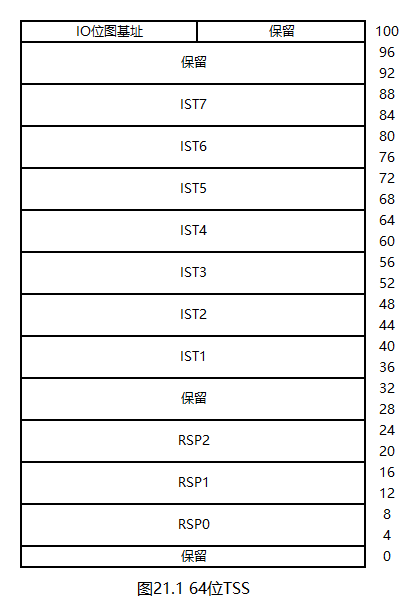

# 一个操作系统的设计与实现

# 第21章 高级可编程中断控制器

## 21.1 什么是高级可编程中断控制器

我们已经使用过型号为8259A的可编程中断控制器（Programmable Interrupt Controller，PIC）。在单CPU计算机中，中断的处理相对简单：所有的外设和CPU都连接在PIC上即可。然而，如果计算机中不止一个CPU，情况就会变得复杂起来。以双CPU为例：

* 键盘中断会被每个CPU分别接收一次，这是错误的
* 时钟中断会统一广播给各个CPU，这样做虽然没有错误，但降低了灵活性

高级可编程中断控制器（Advanced Programmable Interrupt Controller，APIC）用于解决上述问题。顾名思义，APIC是PIC的升级版，其结构如下：

* 既然每个CPU需要独立的接收中断，尤其是时钟中断，那就为每个CPU分别安装一个中断控制器，这些APIC就称为本地APIC（Local APIC，LAPIC）。并且，每个LAPIC中都安装了独立的定时器
* 既然某些外设不能广播到每个CPU上，那就再为外设专门准备一个中断控制器，这个APIC就称为IO APIC
* 任意两个APIC之间都可以通信。也就是说，不仅CPU与外设之间能够使用中断，CPU之间也能互相使用中断

需要注意的是：PIC和APIC在计算机中是并存的，且均与CPU连接。如果要使用APIC，就需要屏蔽PIC的所有信号。IO APIC的所有信号在默认状态下都是屏蔽的。

## 21.2 APIC内存映射

APIC使用内存映射而非IO端口进行通信，这类似于显卡。具体来说：

* LAPIC的内存映射起始地址为`0xfee00000`，大小为2M
* IO APIC的内存映射起始地址为`0xfec00000`，大小为2M
* APIC中的每个寄存器都是32位的

这两个地址均为物理地址，因此，想要在分页模式下使用APIC，就需要为这两个物理地址安装虚拟地址映射。由于需要映射的地址范围均为2M，因此刚好可以使用2M大页模式。此外，CPU要求这些地址映射是禁用缓存的，将各类页表项的第4位置1即可禁用缓存。

综上，在我们的操作系统中，APIC内存映射的实现如下：

* 将`0xfec00000`映射到`0xffff8000fec00000`，使用2M大页模式，禁用缓存
* 将`0xfee00000`映射到`0xffff8000fee00000`，使用2M大页模式，禁用缓存

## 21.3 LAPIC定时器

LAPIC定时器可向其对应的CPU发送时钟中断信号，其通过三个内存地址进行设定：

1. `0xfee00320`：固定设为`0x20000 | 时钟中断向量号`。在我们的操作系统中，时钟中断向量号为`0x20`
2. `0xfee003e0`：设定分频器。在我们的操作系统中，固定设为`0xb`，表示1分频。这里的1表示CPU每经过1个时钟周期，定时器的值就会减1，也就是说，如果将这个1改成比较大的数字，定时器就会变慢，从而能够记录更长的时间
3. `0xfee00380`：设定定时器的初始值。在我们的操作系统中，固定设为`0xffff`。当定时器的值降为0时，就会触发一次时钟中断，然后将定时器重置到初始值。也就是说，定时器的初值越小，时钟中断的触发频率就越高

## 21.4 LAPIC中断响应信号

与8259A一样，中断处理函数需要向LAPIC发送中断响应信号。这一过程很简单：向`0xfee000b0`写入0即可。

## 21.5 64位中断门与IDT

中断门中存放着中断处理函数的地址，因此，在64位模式下，中断门需要拓展，以存放64位的地址。不过，这一拓展是非常简单的，如下图所示：

也就是说，64位中断门只需要在32位中断门的基础上增加8字节即可，其中，前4字节是中断处理函数的高32位，后4字节是0。

64位的IDTR与GDTR一样，也使用`2 + 8 == 10`字节内存。

## 21.6 64位中断

64位中断的发生过程与32位基本一致，但有一个很重要的区别：无关乎特权级是否改变，中断时都会依次压栈`ss, rsp, rflags, cs, rip`；中断返回时都会出栈这五个寄存器。

## 21.7 打开时钟中断

请看本章代码`21/Mbr.s`。

第51行，为APIC安装PDPTE，其指向`0x91000`处的页目录表。

第54\~55行，为APIC安装PDE。使用2M大页模式，并禁用缓存。

以上代码中使用的`0x101018`、`0x91fb0`、`0x91fb8`这些地址，均可由二进制计算器计算得到，这里不再赘述。

接下来，请看本章代码`21/Int.h`。

第3行，声明了`intInit`函数。

接下来，请看本章代码`21/Int.hpp`。

第6行，声明了中断处理函数表。该表由汇编语言定义。

第7行，定义了IDT。IDT中一共有`0x20 + 0x2 == 0x22`个中断门，前`0x20`个是CPU要求的，后`0x2`个是我们的操作系统定义的，每个中断门的大小为16字节。

`__picInit`函数用于屏蔽8259A主片的所有信号。由于从片是接在主片的2号接口上的，故从片也会被屏蔽。

`__apicInit`函数用于设定LAPIC定时器。

`__idtInit`函数用于安装IDT与IDTR。

`intInit`函数是主函数。

接下来，请看本章代码`21/Int.s`。

第9\~52行，定义了`0x0 ~ 0x1f`号中断的处理函数。

`intTimer`函数是时钟中断处理函数。

第56\~70行，执行"pusha"指令。由于没有64位版本的`pusha`指令，故只能这样逐个写。

第72\~73行，向LAPIC发送中断响应信号。

第75\~76行，在每次进入时钟中断时打印一个字符6。

第78\~92行，执行"popa"指令。由于没有64位版本的`popa`指令，故只能这样逐个写。

在时钟中断处理函数中压栈、出栈所有的通用寄存器是为任务切换做准备。64位模式下数据段寄存器已经没有用了，故无需压栈。

第94行，执行`iretq`指令，从中断返回。注意：这里不能简写为`iret`，这是因为`iret`和`iretq`指令在64位CPU中是并存的，前者用于返回到兼容模式代码段。

第96\~130行，定义中断处理函数表。第`0x21`个中断处理函数保留给后续章节使用。

第132\~133行，定义通用中断处理函数使用的格式字符串。

## 21.8 编译与测试

本章代码`21/Makefile`增加了`Int.s`的编译与链接命令。

本章代码`21/Kernel.c`测试了时钟中断。