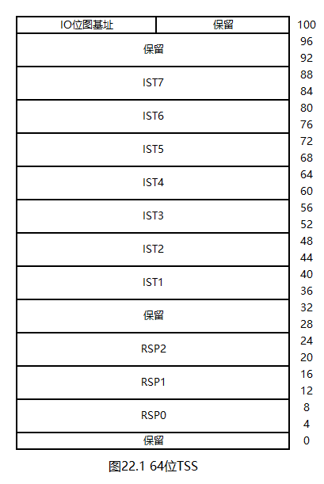

# 一个操作系统的设计与实现

# 第22章 64位任务

## 22.1 64位TSS与TSS描述符

想要实现任务，就需要先安装好TSS与TSS描述符。

64位TSS如下图所示：

如图所示，64位TSS的大小不变，还是104字节。64位CPU淘汰了硬件任务切换和数据段寄存器，因此，64位TSS的组成与32位TSS完全不同，其已不具备保存寄存器的功能，其中的大部分字节用于中断栈表（Interrupt Stack Table，IST），这个功能在我们的操作系统中没有使用。在我们的操作系统中，TSS的作用是取得0特权级栈，这与32位操作系统一样。

64位TSS描述符与中断门类似：在32位TSS描述符的基础上增加了8字节，用于存放TSS地址的高32位，如下图所示：

## 22.2 实现64位任务

想要实现任务加载，就需要先实现硬盘驱动。硬盘驱动的实现位于本章代码`22/HD.h`与`22/HD.s`中，其实现思路与32位操作系统一致，这里不再赘述。

想要实现任务切换，就需要先实现带关中断功能的任务队列。任务队列的实现位于本章代码`22/Queue.h`与`22/Queue.hpp`中，其实现思路与32位操作系统一致，这里不再赘述。

接下来，请看本章代码`22/Mbr.s`。

第155行，在GDT中增加TSS描述符，其索引值为7。TSS固定放置在`0xffff800000092000`处。

接下来，请看本章代码`22/Task.h`。

第7~14行，定义了TCB。我们需要关注此结构体部分成员的偏移量：

* `__tcbNode`中有两个指针，所以`__CR3`的偏移量是`0x10`
* `__RSP0`的偏移量是`0x18`
* `__taskQueue`的偏移量是`0x20`

这些偏移量稍后将用在汇编语言中。

第16~23行，声明了任务队列，以及任务的各类接口。

接下来，请看本章代码`22/Task.hpp`。

第10行，定义了任务队列和退出队列。

`__tssInit`函数用于安装TSS、TR以及`IA32_GS_BASE`。

第14行，将TSS清零。TSS只有104字节，但这里写的是128字节，这样做的目的是：将TSS拓展到128字节，多出的字节保留给后续章节使用。

第15行，填写TSS的IO位图基址字段，如果这个值大于等于TSS限长，则IO位图不存在。

第17行，加载TR。

TSS在`0xffff800000092000`处，在任务切换时，我们需要访问TSS，并安装新的RSP0。TSS的地址是64位的，因此在访问前需要先使用`mov`指令。不过，还有更方便的办法：将`fs/gs`的段基址直接设定为`0xffff800000092000`，然后基于`fs/gs`访问TSS。

`fs/gs`的段基址可由`IA32_FS_BASE`和`IA32_GS_BASE`这两个MSR设定，其编号分别为`0xc0000100`和`0xc0000101`，将`edx:eax`拼成一个64位的地址即可。在我们的操作系统中，选用的是`gs`。

第18行，将`IA32_GS_BASE`设定为`0xffff800000092000`。

`__kernelTaskInit`函数用于安装内核任务的TCB。TCB的`__RSP0`成员在任务切换时设定，`__vBitmap`成员用于3特权级任务，因此这两个成员无需设定。

`taskInit`函数是主函数。

`getTCB`函数用于获取当前TCB。TCB与0特权级栈位于同一页，因此，只需要将RSP0向下对齐到页边界即可。

`__getRFLAGS`函数用于获取一个**打开IF位**的`rflags`。该函数在伪造栈时使用。

`loadTaskPL0`与`loadTaskPL3`函数用于加载任务，其实现思路与32位操作系统一致，这里不再赘述。

需要注意的是：与32位操作系统不同，新操作系统的外壳程序不再具备等待任务的功能，任务在运行期间的行为类似于Linux的后台任务。因此，不再有`shellQueue`，`loadTaskPL3`函数的末尾也不再立即进行任务切换。

`deleteTask`函数用于回收`exitQueue`中的TCB。

接下来，请看本章代码`22/Task.s`。

`taskExit`函数用于任务退出。

第13行，回收任务内存空间中的所有内存，在我们的操作系统中，这部分内存包括任务的ELF文件要求的内存，以及任务的3特权级栈。

第15~19行，将任务的TCB加入`exitQueue`。

第21行，跳转至`__nextTask`。这个地址位于`Int.s`，作用是从`taskQueue`中取出一个新的TCB，并切换到新任务。

接下来，请看本章代码`22/Int.s`。

`intTimer`函数现在用于任务切换。

第79~81行，计算当前任务的TSS。

第83行，将`rsp`保存到TSS的`__RSP0`成员中。

第85~87行，将TSS加入TSS的`__taskQueue`成员所指定的任务队列中。

第89行，声明了`taskExit`函数使用的`__nextTask`标签。

第91~93行，从`taskQueue`中取出一个新的TSS。

第95~96行，安装新任务的PML4。

第98行，安装新任务的栈。

第100~101行，将新任务的0特权级栈安装到TSS中。这里使用了先前设定的`IA32_GS_BASE`。

第103~119行，从中断返回到新任务。

## 22.3 编译与测试

本章代码`22/Test.c`用于测试3特权级任务。我们虽然已经实现了任务退出函数，但还没有为其安装系统调用，因此任务是不能退出的。

本章代码`22/Makefile`增加了`Task.s`、`HD.s`、`Test.c`的编译与链接命令。

本章代码`22/Kernel.c`测试了`loadTaskPL3`与`deleteTask`函数。由于3特权级任务什么都不能做，因此读者可在`bochsdbg`中观察测试结果。

