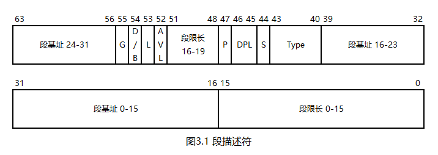

# 一个操作系统的设计与实现

# 第3章 保护模式

在实模式下，内存的访问是没有任何限制的，任何程序都能访问和修改任何内存地址，这就导致了实模式下的程序，甚至操作系统自己，都可能自身难保。于是，80286 CPU引入了早期版本的保护模式，80386 CPU引入了沿用至今的32位保护模式。

## 3.1 内存为什么要分段

在讨论保护模式之前，需要先讨论一个问题：内存为什么要分段？

在实模式下，由于段寄存器只有16位，而地址线有20根，所以，需要拼接两个寄存器才能得到物理地址。这样看来，内存分段仅仅是一个补丁，用于解决寄存器宽度不够的问题，一旦单个寄存器的宽度足够了，分段机制就不再需要了。

事实上，内存分段的作用不仅仅是一个补丁。请看以下代码：

```asm
section text

    mov bx, helloStr

helloStr:
    db 'Hello'
```

如果上述代码是MBR的一部分，那么可以确定其加载地址是`0x7c00`。然而，如果上述代码是操作系统在运行过程中动态加载的一段程序，其加载地址又将如何确定呢？

比较直接的方案是：在汇编代码中硬编码`vstart=加载地址`，并想办法告知操作系统这个地址（如记录在文件的头部）。这种方案虽然简单，但有一个很大的缺点：各程序的加载地址必须由人工预先安排好，且尽量不能重叠，一旦重叠，则受到重叠影响的程序一次只能加载一个，其他程序必须排队等待第一个程序的结束。

人工预先安排加载地址显然是非常麻烦的，而分段机制可以解决此问题：其将内存地址的确定分成了两部分，一部分是偏移地址，由编译器负责。编译器只需要将地址视为相对于文件开头的偏移量即可，无需关注这个程序被加载到哪里。另一部分是段基址，由操作系统负责。操作系统在加载一个程序时，只需要在内存中随便找一段能够容纳这个程序的内存，然后将程序加载到这段内存处，并将段基址设为这段内存的起点。此时，将段基址和偏移地址相加，就能确定内存地址了。

上述加载过程被称为重定位。编译器计算程序中的偏移地址时，进行的是首次定位；操作系统通过修改段寄存器，再次影响了程序中的地址，故称为重定位。

综上，使用分段机制的主要目的是程序的重定位，解决寄存器宽度不够的问题反而是一个附带的功能。也就是说，即使寄存器的宽度足够了，分段机制也依然有存在的意义。

## 3.2 保护模式的实现原理

保护模式，是具备内存保护功能的模式。想要保护一段内存，就需要设定这段内存的起点、长度、功能、权限等信息，然后，CPU就能根据这些信息对一段内存进行保护了。

### 3.2.1 段描述符

段描述符用于设定一段内存的各项信息。一个段描述符的大小为8字节，其结构如下图所示：



* 第0\~15位是段限长的低16位。段限长的定义将在下文中描述
* 第16\~39位是段基址的低24位
* 第40\~43位是Type位，第44位是S位，这5位共同决定了当前段的类型。如果S位为0，表示当前段是系统段；如果S位为1，表示当前段是非系统段。系统段是一类特殊用途的段，其不在本章中讨论；非系统段分为两种：代码段和数据段，其Type位的取值和含义如下：

| Type位取值 | 含义                             |
| :--------- | -------------------------------- |
| 0000       | 数据段，只读，向上拓展           |
| 0001       | 数据段，只读，向上拓展，已访问   |
| 0010       | 数据段，可读写，向上拓展         |
| 0011       | 数据段，可读写，向上拓展，已访问 |
| 0100       | 数据段，只读，向下拓展           |
| 0101       | 数据段，只读，向下拓展，已访问   |
| 0110       | 数据段，可读写，向下拓展         |
| 0111       | 数据段，可读写，向下拓展，已访问 |
| 1000       | 代码段，仅执行                   |
| 1001       | 代码段，仅执行，已访问           |
| 1010       | 代码段，可读，可执行             |
| 1011       | 代码段，可读，可执行，已访问     |
| 1100       | 依从代码段，仅执行               |
| 1101       | 依从代码段，仅执行，已访问       |
| 1110       | 依从代码段，可读，可执行         |
| 1111       | 依从代码段，可读，可执行，已访问 |

观察上表可以发现：Type的第3位决定了当前段是代码段还是数据段；第2位决定了当前段是否被访问，这一位由CPU在访问该段时自动设为1，初始化时应将其设为0。访问位存在的意义将在下文中讨论。

对于数据段，只读/可读写很好理解。向上拓展/向下拓展是配合段限长使用的，如果是向上拓展的段，就需要满足这个公式：`段基址 + 段限长 == 段的最后一个可用地址`。也就是说，段限长在数值上等于段的大小减1。向下拓展的段的计算方式十分难理解，我们也不使用该功能，所以就不讨论了。

对于代码段，可读，可执行都很好理解；依从代码段这一概念超出了本章的讨论范围，我们也不使用该功能，所以就不讨论了。

* 第45\~46位是DPL位，即描述符特权级（Descriptor Privilege Level，DPL）位。特权级这个概念不在本章中讨论，目前读者只需要知道：特权级一共有4级，分别是0\~3级。0特权级权限最高，用于操作系统；3特权级权限最低，用于普通程序。中间的两级在我们的操作系统中不使用。所以，现在应使用0特权级
* 第47位是P位，即存在（Present）位。P位为1时，表示段描述符存在；P位为0时，表示段描述符不存在。P位看似多此一举，段描述符写了就是存在，没写就是不存在，为什么还要再标注一下？这是因为，P位是配合Type中的访问位一起使用的。设想：现在有一个GDT，里面有一些段描述符，此时内存突然不够用了，操作系统就可以遍历GDT，找到一个虽然存在（P位为1），但没有被使用（访问位为0）的段，将这段内存保存到硬盘上，然后将段描述符的P位置0，表示"这个段暂时不存在了"。这样，内存就空出来了。另一方面，当CPU加载一个P位为0的段时，会引发一个异常以通知操作系统，于是操作系统又将这个段恢复。由此可见，P位和Type字段中的访问位，是给CPU和操作系统在内存不足时使用的。不过，我们的操作系统并不实现这一机制，故所有段描述符中的P位始终为1
* 第48\~51位是段限长的高8位
* 第52位是AVL位，即可用（Available）位。这一位是CPU送给操作系统的，CPU保证不会使用该位。我们的操作系统不使用该位
* 第53位是L位，这一位保留给64位硬件使用，需要将其置0
* 第54位是D/B位，这一位用于兼容80286。当D/B位为0时，当前段工作在16位模式下；当D/B位为1时，当前段工作在32位模式下
* 第55位是G位，即粒度（Granularity）位。G位影响段限长的含义：当G位为0时，段限长表示的就是字节数；当G位为1时，段限长需要乘`0x1000`。所以，当G位为1时，段限长能够达到32位
* 第56\~63位是段基址的高8位

观察段描述符的结构，可以发现一个不合理之处：段基址为什么是拆成两部分的？

这是因为段描述符在80286中就有了，而80286只有24根地址线，所以，它的段描述符是这样的：


因此，出于兼容性的考虑，80386及其后续产品的段描述符，就只能设计成如今这个样子了。

### 3.2.2 全局描述符表

全局描述符表（Global Descriptor Table，GDT）是一段连续的内存，其中存放的是段描述符。

CPU要求：GDT的第0个表项必须存在且为0，可用的表项从第1项开始。这样做的意义将在后续章节中讨论。

此外，Intel建议：GDT的起始地址应对齐到8字节，以获得最佳效率。

### 3.2.3 全局描述符表寄存器

GDT准备好后，需要将其信息加载到CPU中。具体来说，CPU需要知道这两件事：

1. GDT在哪里？
2. GDT有多长？

CPU使用全局描述符表寄存器（Global Descriptor Table Register，GDTR）存储上述信息，这是CPU内部的一个专用寄存器。

`lgdt [...]`指令用于加载GDTR，参数地址指向一段48位的内存，其中，低16位存储GDT限长，高32位存储GDT的起始地址。和段限长一样，GDT限长在数值上等于GDT的大小减1。

此外，`sgdt [...]`指令的功能和`lgdt [...]`相反，其可将GDTR存放到指定的内存中。

### 3.2.4 段选择子

在保护模式下，段的各种信息都存放在段描述符中，段寄存器中存放的是段选择子（Segment Selector）。段选择子是一个16位的数值，结构如下：


RPL是请求特权级（Requested Privilege Level，RPL），这也是一个特权级概念，目前将其置0即可。

TI位用于标识局部描述符表（Local Descriptor Table，LDT），我们的操作系统并不使用LDT，故此位置0。

从段选择子的结构可以看出，在保护模式下，段寄存器起到的作用是在GDT中**选择**一个段描述符，然后在描述符从中取得段基址。

## 3.3 分段机制和平坦模型

在实模式下，寄存器只能存放16位的偏移地址，故一个段最大为64K。想要访问全部的1M内存，就需要换段。例如，想要访问从`0xb8000`开始的显存，就需要先将段寄存器设为`0xb800`。这样不停的换段是一件很麻烦的事。当寄存器升级到32位以后，单一寄存器已经能够访问全部的32位内存地址。于是，可以将段基址设为0，段限长设为最大，G位设为1，这样一来，整个4G内存就成了一个超长的段。这样的内存模型被称为平坦模型。平坦模型不具备重定位能力，这个问题将在后续章节中讨论。

## 3.4 进入保护模式的步骤

想要进入保护模式，需要依次进行以下操作。

### 3.4.1 加载GDT

GDT需要在进入保护模式之前准备好，然后通过`lgdt [...]`指令加载。

### 3.4.2 打开A20地址线

8086有20根地址线，这些地址线依次被称为A0\~A19地址线。地址线的数量是可以被编程技巧利用的，具体来说，程序可以故意让内存地址溢出，使其回卷到0。当地址线变得更多时，这一技巧就不管用了。所以，出于兼容性的考虑，第21根地址线，即A20地址线上安装了一个开关，当开关断开时，地址计算会在A20地址线处停止，从而模拟了只有20根地址线时的效果。32位保护模式不需要这个功能，所以需要打开A20地址线。

打开A20地址线的具体操作如下：

```asm
in al, 0x92
or al, 0x2
out 0x92, al
```

这里使用的`in`和`out`指令是操作系统中比较常用的指令。在CPU中，有的外部设备被映射到内存地址上，如显存；更多的外部设备，如硬盘，显卡，键盘等，使用一套独立的地址进行访问，这套地址被称为IO端口。不同的外部设备被分配了不同的IO端口号。`in`，`out`指令用于对IO端口进行读写。

这两条指令的语法比较严格，只能使用以下格式中的一种：

```asm
in al, 8位立即数
in al, dx
in ax, 8位立即数
in ax, dx

out 8位立即数, al
out dx, al
out 8位立即数, ax
out dx, ax
```

也就是说，必须使用AL或AX存放数据，具体使用哪个取决于端口的要求。端口号必须存放在DX中，或使用一个8位立即数（如上面的`0x92`）。

### 3.4.3 设定CR0寄存器

CR0是一个控制寄存器，其用于控制CPU的多项运行模式。保护模式的开关位于CR0的第0位。CR0是一个32位寄存器，其只能和32位通用寄存器互相传送。因此，需要使用以下代码来启动保护模式：

```asm
mov eax, cr0
bts eax, 0
mov cr0, eax
```

## 3.5 进入保护模式

请看本章代码`3/Mbr.s`。

第31\~39行，定义了GDT以及用于`lgdt`指令的GDTR。GDT中的段描述符定义如下：

* 空描述符
* 代码段描述符，仅执行，段选择子是`1 << 3`
* 数据段描述符，可读写，段选择子是`2 << 3`

第3行，加载GDT。

第5\~7行，打开A20地址线。

第9\~11行，打开CR0中的保护模式开关。

进入保护模式后，需要尽快更新6个段寄存器。

第13行，使用远跳转指令修改CS，这条指令同时具备两个功能：

1. 修改CS。由于代码段描述符中的D/B位是1，所以CPU现在工作在32位模式下
2. 远跳转指令会清空指令译码器缓存，迫使其重新译码。这正是这里需要的，因为先前的译码器工作在16位模式下，不能对32位的指令正确译码

第15行，将编译模式声明为32位。`[bits 32]`是nasm提供的伪指令，在默认情况下，nasm的编译模式是16位，即`[bits 16]`，使用这个伪指令后，nasm就会切换到32位编译模式。`bits`的生效范围直至下一个`bits`或文件结尾。

第19\~24行，将5个数据段寄存器修改为数据段选择子。

第26\~27行，通过直接访问显存的方式在屏幕左上角打印一个`6`，这在实模式下是做不到的。

