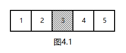
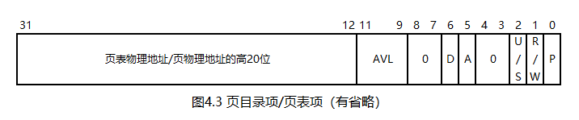

# 一个操作系统的设计与实现

# 第4章 分页模式

## 4.1 什么是分页模式

让我们以这幅图开始本章的内容：



这是一段内存，每格为1字节，阴影部分的内存被占用。此时，如果向内存中加载一个4字节的程序，显然是做不到的。然而，此时的空闲内存其实是够4字节的，纯粹是因为其不连续，导致了这样的结果。看来，问题的关键在于内存连续。如果有一种办法能让内存不连续，问题就解决了。

但是，如果一个程序使用的内存是不连续的，那将是一件非常可怕的事情。我们习以为常的"一个数组就是一段连续内存"，甚至"一个整数由一小段连续内存构成"这样的结论通通要被推翻。所以，程序使用的内存必须是连续的。

虽然这条路走不通，但还有更好的办法，那就是增加中间层。具体来说，可以构造一个数组，数组中存放的是内存地址。数组的索引值一定是连续的，而数组中的值可以不连续。程序使用连续的索引值作为内存地址，而真正的内存地址需要通过这个数组获得。例如，可以给上述4字节程序提供这样的一个数组：

```
[0, 1, 3, 4]
```

程序可以使用连续的内存地址0\~3，经过数组转换后，实际的内存地址依次是0、1、3、4。

甚至，这个数组还可以有多种设计方案：

```
[4, 3, 0, 1]
[3, 0, 4, 1]
...
```

无论这个数组怎么设计，程序使用的内存地址都是连续的0\~3，而实际的内存地址可以不连续。

使用这个方法后，程序使用的地址实际上是个假的地址，其被称为虚拟地址；数组中的地址才是真正的物理地址；这个数组被称为页表（Page Table）；数组中的值被称为页表项（Page Table Entry，PTE）；这种基于页表对地址进行转换的模式被称为分页模式（Paging mode）。分页模式成功解决了内存总量够用，但不连续这一问题。

## 4.2 分页模式的具体细节

### 4.2.1 页目录表、页表与页

32位CPU有32根地址线，最大支持4G内存。如果为这么多的内存构造一个页表的话，一个PTE是一个4字节的内存地址，4G个PTE就需要16G的页表。这是一个很离谱的结果：页表竟然比最大可用内存还大的多。造成这个结果的原因在于：PTE的粒度太小了，一个PTE只对应一字节内存，这就导致需要非常多的PTE才能把4G内存全部对应好。因此，需要扩大一个PTE对应的内存大小，从而减少PTE的数量。这个大小取多少比较好呢？CPU已经帮我们选好了：4096字节，即`0x1000`字节。这么大的一块内存被称为一页（Page），页表就是存放页的表。

如果以页作为单位构造页表，就需要`1 << 20 == 1048576`个PTE，此时，页表的大小减少至4M。虽然这个大小在今天看来没什么，但是在80386那个年代，4M内存仍然是不可接受的。需要想办法进一步减少页表的大小。

考察`1 << 20`这个数字，对其开根号，可以得到`1 << 10`，即1024。也就是说，一个具有`1 << 20`个PTE的页表，可以拆成1024个具有1024个PTE的页表。此时，可以再使用一张表，其中填入这1024个页表的地址，就得到了一个二级页表，其被称为页目录表（Page Directory Table）；页目录表中的值被称为页目录项（Page Directory Entry，PDE ）。

乍一看，引入页目录表是个负优化。本来有`1024 * 1024`个PTE，现在还要再加1024个PDE。然而，由于绝大多数程序所使用的内存都很少，所以只需要很少的页表，甚至一个页表就够了。因此，剩余那些没有用到的页表都可以不存在，页表占用的内存也就大大降低了。

综上，想要从虚拟地址转换为物理地址，需要以下三个步骤：

1. 从页目录表中找到一个PDE，从中取得页表地址
2. 从页表中找到一个PTE，从中取得页地址
3. 将页地址加上偏移量，就得到了物理地址

进一步的：

1. 一个页目录表或页表都有1024个表项，每个表项为4字节，所以，一个页目录表或页表的大小都是`0x1000`字节，刚好是一页的大小。因此，一页内存既可以是页目录表，也可以是页表，还可以是一个普通的页
2. 1024个表项可以用一个10位的二进制数作为其索引；页内偏移量可以用一个12位的二进制数表示。所以，页目录表索引、页表索引、页内偏移量加起来刚好是32位，与32位寄存器完美契合

### 4.2.2 虚拟地址

如前文所述，分页模式下，32位的虚拟地址由以下三个部分组成：


### 4.2.3 PDE与PTE

CPU规定：页地址必须是`0x1000`的整数倍，因此，页地址的低12位都是0。于是，PDE和PTE的低12位被"废物利用"了起来，如下图所示：



P位是存在（Present）位。对于PDE来说，P位为0意味着页表不存在，这就是上文所说的"没有用到的页表都可以不存在"这一优化；对于PTE来说，P位为0意味着页不存在。反之，P位为1意味着页表或页存在。

R/W位用于设定当前PDE或PTE中的内存是只读，还是可读写。R/W位为0时，表示只读；R/W位为1时，表示可读写。在我们的操作系统中，此位全部设为1。

U/S位用于设定访问权限。U/S位为0时，只有0、1、2特权级能够访问该PDE或PTE中的内存；U/S位为1时，所有特权级都能访问这段内存。在我们的操作系统中，使用该位对3特权级进行访问限制。

A位和D位分别是访问（Access）位与脏页（Dirty）位。这两位都由CPU自动设置：当访问一个PDE或PTE中的内存时，设置A位为1；当修改一个PDE或PTE中的内存时，设置D位为1。与段描述符中的A位一样，这两位与P位配合使用。在构造页目录表和页表时，应将这两位置0。

AVL位为可用（Available）位，我们的操作系统不使用这些位，将其置0。

此外，上图中省略了页级通写位等我们不使用的位。

### 4.2.4 CR3

页目录表是地址转换的起点，有了页目录表，才能得到页表地址，然后得到页地址，最后得到物理地址。所以，CPU专门为页目录表准备了一个控制寄存器CR3。在打开分页模式之前，需要将页目录表的物理地址安装到CR3中。与CR0一样，CR3只能与通用寄存器互相传送。

需要指出的是，CR3的低12位也用于一些功能的设定，但我们的操作系统并不使用这些功能，所以，CR3中存放的就是页目录表的物理地址。

### 4.2.5 CR0

与保护模式类似，分页模式的开关位于CR0的最高位上，当此位置1时，分页模式就打开了。所以，一定要在各项准备工作均已完成后，才能进行这一步。

## 4.3 分页与分段的关系

如果CPU同时启动了分段和分页模式，其地址转换过程是：分段在先，分页在后。也就是说，内存地址先通过`段基址 + 偏移地址`的方式产生，如果分页模式未启用，则此地址就是物理地址；如果分页模式启用，则此地址被当做虚拟地址，交由分页机制转换为物理地址。

由于我们的操作系统使用的是平坦模型，段基址为0，故分段机制不会对内存地址造成任何影响。

## 4.4 进入分页模式

想要进入分页模式，就需要先安装好页目录表和页表。一旦进入分页模式，内存地址的含义就会瞬间发生改变。想要不发生混乱，就需要满足一个条件：目前正在使用的这部分地址不能受分页模式影响，即：这些内存地址在分页模式下应转换到其自身。具体来说，目前正在使用的是低端1M内存，所以，对于页目录表来说，只需要安装第一个PDE，将其指向第一个页表；对于第一个页表来说，需要安装前256个PTE。

由于低端1M内存已被使用，页目录表可以放在`0x100000`处，页表可以放在`0x101000`处。

请看本章代码`4/Mbr.s`。

第1\~24行与上一章一致，用于进入保护模式。

第26\~29行，清空页目录表与页表使用的内存，这样做将使得所有PDE与PTE的P位都为0。两个表的总大小是`0x1000 + 0x1000 == 0x2000`，`stosd`指令一次处理4字节，故循环次数需要除以4。

第31行，在页目录表中安装第一个PDE，将其指向`0x101000`，属性为`0x3`，即页表存在，可读写，3特权级不允许访问。

第33\~42行，在页表中安装前256个PTE。EAX中存放的是页地址，属性为`0x3`，每次循环递增一页；EBX中存放的是PTE地址，每次循环递增4。

第44\~45行，将页目录表的物理地址安装至CR3。CR3只能与通用寄存器互相传送，故不能使用`mov cr3, 0x100000`这样的指令。

第47\~49行，打开分页模式。在分页模式打开的一瞬间，CPU对内存地址的解释就发生了变化，不过，由于页目录表和页表的设定，这种变化对低端1M内存不产生任何影响。

第51\~52行，在分页模式打开后访问显存，以验证低端1M内存确实不受分页模式影响。

## 4.5 bochs调试器的使用

随着代码的增加，出现错误也在所难免，此时，就需要使用bochs调试器了。

使用本章代码进入bochs调试器后，屏幕的左侧显示的是寄存器信息；中间是指令；右侧用于显示多种内容；下方则是命令输入和显示窗口。

bochs调试器的使用是基于命令的，下面是常见的一些命令：

1. b、lb

   `b`命令用于以物理地址设置断点；`lb`命令用于以虚拟地址设置断点。例如：

   ```
   b 0x7c00
   ```

   在指令上双击也可以设置断点。

2. c

   `c`命令将使代码继续执行，直至遇到了一个断点。

3. p或n

   `p`或`n`命令等价，用于执行下一条指令，且不进入函数体、`loop`指令等。

4. s

   `s`命令也用于执行下一条指令，并且会进入函数体、`loop`指令等。

   `s`命令可以后接一个数字，表示执行的指令数。

   如果什么命令都不输入直接回车，也相当于执行了一次`s`命令。

5. d、blist

   `d`命令用于删除断点，其参数为断点的编号。例如：

   ```
   d 1
   ```

   `blist`命令用于查看断点信息。在GUI的`View`菜单中也有显示断点信息的按钮。

6. r、sreg、creg

   这三个命令分别用于查看通用寄存器，段寄存器，控制寄存器的信息。其内容比GUI中显示的更详细。

7. ？

   `?`是一个内置的计算器，可以直接将寄存器作为表达式的一部分进行计算，有时候比较方便。例如：

   ```
   ? eax * 0x1000
   ```

8. print-stack

   `print-stack`命令用于显示栈信息。在GUI中，也可以使用`F2`快捷键查看。

9. info gdt

   `info gdt`命令用于查看GDT信息。在GUI中，也可以使用`Ctrl + F2`快捷键查看。

10. page

   `page`命令用于查询一个虚拟地址对应的物理地址。例如：

   ```
   page 0x7c00
   ```

11. info tab

    `info tab`命令用于查看虚拟地址到物理地址的映射关系。在GUI中，也可以使用`Alt + F2`快捷键查看。

12. q

   `q`命令用于退出调试器。

此外，可以使用`help`命令查看bochs调试器支持的所有命令，也可以使用`help`命令查看某个命令的具体说明。

使用本章代码启动bochs调试器后，首先看到的这段指令属于BIOS。此时，执行`b 0x7c00`命令，再执行`c`命令，就来到了MBR的第一条指令`lgdt [GDTR]`，其执行后，GDT就加载好了。于是，按下回车执行这条指令（相当于一次`s`命令），然后使用`info gdt`命令查看GDT信息，也可以使用`Ctrl + F2`快捷键，但显示的信息不如前者详细。

接下来值得关注的是第11行的`mov cr0, eax`指令。这条指令执行前后，分别用`creg`命令查看CR0，会发现CR0后面的`PE`从小写变成了大写，说明保护模式已经启动。

接下来的`jmp`指令同样值得关注。在这条指令执行前，可以发现其后的指令是不正确的，但跳转后就正确了，这说明此时的译码器已经切换到32位模式。

第49行的`mov cr0, eax`指令用于打开分页模式，这条指令执行后，使用`info tab`命令或`Alt + F2`快捷键查看虚拟地址与物理地址的映射关系，结果如下：

```
0x00000000-0x000fffff -> 0x000000000000-0x0000000fffff
```

这表明，低端1M内存的虚拟地址与物理地址是完全一致的。

