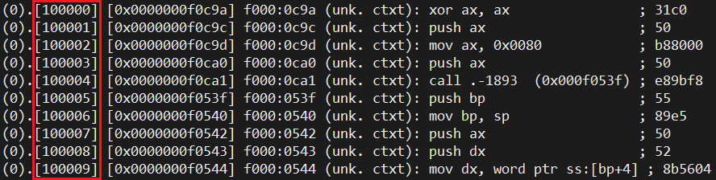

# 一个操作系统的设计与实现

# 第7章 中断

## 7.1 什么是中断

中断是一种能够随时打断CPU正常工作的机制。这句话看着挺别扭的，CPU工作的好好的，为什么要"随时打断"它？这是因为，CPU需要为诸多外部设备提供服务，以键盘为例，当键盘上的键被按下时，CPU需要对此做出响应和处理，如果不能及时响应，我们会说："电脑很卡"；如果一直都不能响应，我们会说："电脑死机了"。由此可见中断的重要性。同时，"键盘被按下"完全是一种人为的操作，是不能用一段代码进行预测的，所以中断必须具备"随时打断CPU正常工作"的能力。正是由于这个能力，中断在CPU内部也有应用，例如：当CPU遇到除0错误，页不存在等问题时，都是通过发起一个中断进行处理的。

## 7.2 中断的具体细节

### 7.2.1 中断门与中断描述符表

本章开头的这段介绍把中断说的玄乎其神的，好像非常复杂的样子。事实上，中断就是一些函数，中断发生时，就相当于突然调用了一个函数。

既然中断就是一些函数，那么这些函数该如何找到呢？CPU要求：各个中断处理函数的信息需要安装在中断描述符表（Interrupt Descriptor Table，IDT）中。IDT与GDT类似，GDT中存放的是段描述符，而IDT中存放的是中断门描述符（Interrupt Gate Descriptor），简称中断门，它是系统段的一种，结构如下：


从中断门的结构可以看出，其确实用于描述一个函数，CS和EIP都可以从中找到。

### 7.2.2 `lidt`指令

与GDT类似，IDT需要通过`lidt [...]`指令进行加载，其被存放在中断描述符表寄存器（Interrupt Descriptor Table Register，IDTR）中，这是CPU内部的一个专用寄存器；`lidt [...]`指令以一段48位的内存作为参数，其低16位是IDT的长度，在数值上等于IDT的大小减1；高32位是IDT的起始地址。

`lidt`指令也有一个功能与之相反的`sidt`指令，其用于将IDTR存放到指定的内存中。我们的操作系统中不使用该指令。

### 7.2.3 `int`指令

中断处理函数的调用不使用普通的`call`指令，而是使用`int`指令。该指令以一个整数作为参数，其被称为中断号。中断号就是IDT的索引值，所以，当中断发生时，CPU会使用中断号从IDT中找到一个中断门，然后调用中断门中的函数。

中断处理函数被调用时的压栈比`call`指令复杂一些，这里只讨论0特权级下的压栈。当中断发生时，CPU会依次进行以下操作：

1. 将EFLAGS压栈，然后将EFLAGS的IF位清零（见下文）
2. 将CS通过高位补0的方式扩充至32位，然后压栈
3. 将EIP压栈
4. 使用中断号从IDT中找到一个中断门，将CS和EIP修改为中断门中的CS和EIP

中断号只能是一个8位整数，也就是说，中断号的取值范围是0\~255。

### 7.2.4 `iret`指令

`iret`指令是配合`int`指令使用的中断返回指令，其行为与`int`指令完全相反。同样的，这里只讨论0特权级下的过程。当`iret`指令执行时，CPU会依次执行以下操作：

1. 从栈中弹出EIP
2. 从栈中弹出CS，并丢弃高16位
3. 从栈中弹出EFLAGS

至此，CS、EIP和EFLAGS就恢复到了中断发生前的状态。

### 7.2.5 CPU内部预设的中断

前文提到，CPU自己也会发起中断，这些中断的中断号是预设好的。比较麻烦的是，这些中断的一小部分还会在`int`指令压栈完毕后，再额外压栈一个4字节的错误码，且`iret`指令不负责处理错误码。CPU内部预设的中断如下表所示：

| 中断号     | 是否有错误码 | 含义                                        |
| ---------- | ------------ | ------------------------------------------- |
| 0x0        | 无           | 除0错误                                     |
| 0x1        | 无           | 调试                                        |
| 0x2        | 无           | 不可屏蔽（NMI）中断，往往意味着硬件级的错误 |
| 0x3        | 无           | 断点                                        |
| 0x4        | 无           | 溢出                                        |
| 0x5        | 无           | 边界溢出                                    |
| 0x6        | 无           | 无效的指令                                  |
| 0x7        | 无           | FPU不存在                                   |
| 0x8        | 有           | 双重错误                                    |
| 0x9        | 无           | 保留                                        |
| 0xa        | 有           | 无效的TSS                                   |
| 0xb        | 有           | 段不存在                                    |
| 0xc        | 有           | 栈段错误                                    |
| 0xd        | 有           | 一般保护性异常                              |
| 0xe        | 有           | 页不存在                                    |
| 0xf        | 无           | 保留                                        |
| 0x10       | 无           | 浮点错误                                    |
| 0x11       | 有           | 对齐检查                                    |
| 0x12       | 无           | 机器检查                                    |
| 0x13       | 无           | SIMD浮点异常                                |
| 0x14\~0x1f | /            | 保留                                        |

从`0x20`开始的中断号都可供操作系统和用户使用，且不存在错误码这个概念。

### 7.2.6 外中断

中断不仅能通过`int`指令发起，如键盘等外部设备也能发起中断。通过`int`指令发起的中断被称为内中断；外部设备发起的中断被称为外中断；CPU自己发起的中断也是内中断。

EFLAGS的第9位被称为中断允许位（Interrupt Enable Flag，IF）。当这一位为0时，任何外中断都会被屏蔽；当这一位为1时，则不会屏蔽任何外中断。内中断不受此位影响。

IF位可由`sti`，`cli`，以及其他能够影响EFLAGS的指令控制。`sti`指令将IF位置1，不屏蔽外中断；`cli`指令将IF位置0，屏蔽外中断。

当中断发生时，CPU会先将EFLAGS压栈，然后将IF位置零，所以，在中断处理函数调用期间，不会再次发生外中断。这是一个非常重要的性质，虽然在本章中暂时用不到。另一方面，当执行`iret`指令时，由于EFLAGS已经先行压栈，故IF位会恢复到中断发生之前的状态。

### 7.2.7 可编程中断控制器

计算机中的很多外部设备都可以发起中断，但CPU一次只能处理一个中断，这就带来了一个严重问题：如果多个外部设备几乎同时发起中断，CPU就响应不过来了。于是，在外部设备与CPU之间存在一个中间层，其被称为可编程中断控制器（Programmable Interrupt Controller，PIC）。在我们的操作系统中，使用的是名为8259A的PIC。

一片8259A芯片可以接8个外部设备，并使用一根信号线输出中断信号。在内部，8259A会对外部设备发来的中断信号进行暂存，并依次向CPU发送。此外，各接口对应的中断号也由8259A设定。不过，8个接口实在是有点少，故实际当中使用两片级联的8259A，其中一片被称为主片，其信号线接入CPU；另一片被称为从片，其信号线固定接在主片的第三个接口上。这样一来，两片级联的8259A就能够提供15个接口供外部设备使用（主片已经被占用了一个接口）。这15个接口所接入的外部设备是固定的，如时钟，键盘，硬盘，鼠标等。在我们的操作系统中，只使用这些接口的前两个，其接入的外部设备分别是时钟和键盘。

既然是可编程中断控制器，那就需要对其编程才能使用。这涉及到4个端口：`0x20`和`0x21`端口属于主片，`0xa0`和`0xa1`端口属于从片，这些端口需要连续多次写入不同信息，才能完成设定。具体操作步骤如下：

1. 向`0x20`端口写入`0x11`。这是一个固定用法
2. 向`0x21`端口写入主片的起始中断号。起始中断号必须是8的整数倍，8个接口的中断号从此数字开始顺延。在我们的操作系统中，主片的起始中断号应设为`0x20`，这是第一个可用的中断号
3. 向`0x21`端口写入`0x4`。这个数字是一个8位的位掩码，用于描述从片接的是主片的哪个接口，接入的这个接口置1，其余接口置0。由于从片固定接入主片的第三个接口，所以位掩码是`0x4`
4. 向`0x21`端口写入`0x1`。这是一个固定用法
5. 向`0xa0`端口写入`0x11`。这是一个固定用法
6. 向`0xa1`端口写入从片的起始中断号。同样的，起始中断号必须是8的整数倍，8个接口的中断号从此数字开始顺延。在我们的操作系统中，从片的起始中断号应设为`0x28`，从主片的中断号顺延
7. 向`0xa1`端口写入`0x2`。与主片不同的是，从片写入的这个数字，表示主片被用于接从片的接口的索引值。由于主片的第三个接口，即索引值为2的接口被用于接从片，所以是`0x2`
8. 向`0xa1`端口写入`0x1`。这是一个固定用法
9. 向`0x21`端口写入`0xfe`。这个数字是一个8位的位掩码，用于设定8259A对主片的8个接口的中断屏蔽。想要屏蔽一个接口，就需要将其对应的位置1，反之亦然。因此，目前CPU只能接收到时钟中断
10. 向`0xa1`端口写入`0xff`。这个数字是一个8位的位掩码，用于设定8259A对从片的8个接口的中断屏蔽。因此，整个从片都被屏蔽

至此，8259A就初始化完毕，可以使用了。

### 7.2.8 中断响应

当多个外中断发生时，8259A会将这些中断信号暂存，并依次向CPU发送。那么，8259A怎么知道CPU是否准备好接收下一个中断了呢？这就需要在中断发生后，由中断处理函数向8259A发送中断响应信号。具体来说，需要进行以下操作：

1. 向`0x20`端口写入`0x20`
2. 向`0xa0`端口写入`0x20`

这样一来，8259A就知道CPU已经准备好响应下一个中断了，否则，8259A将不会继续发送中断信号。

## 7.3 启用时钟中断

时钟看上去是一个没什么用的外部设备，但实际上意义重大。时钟可以以恒定的频率发起中断，利用这一特点，CPU可以完成任务切换，计时等重要功能。在本章中，仅使用时钟中断打印一个字符，以观察效果。

中断部分的代码，往往涉及大量的端口操作，如PIC的初始化；或是对栈十分敏感，如中断处理函数。所以，本章代码采用汇编语言与C语言混合编程。

请看本章代码`7/Int.s`。

第1行，将编译模式设定为32位。

第3\~4行，声明外部链接的`printInt`函数和`printf`函数。`extern`关键词的作用相当于C语言的外部链接声明。

第6\~7行，将`intList`符号与`__picInit`函数声明为外部链接的。与C语言不同，nasm汇编语言中的符号默认是内部链接的，只有使用`global`关键词声明的符号才是外部链接的。

`__picInit`函数用于初始化8259A。

第40\~51行定义了一个宏。nasm的宏有两种：单行宏与多行宏，这里使用的是后者。多行宏的语法是：

```
%macro 宏名 参数个数
...
%endmacro
```

不同于C语言，nasm的多行宏的参数没有名称，只有一个从1开始的数字编号，第一个参数写为`%1`，第二个参数写为`%2`，以此类推。当使用宏参数构造符号名时，不需要像C语言那样前置`##`，第42行的`int%1`就使用了这一语法。

这个宏定义的是通用的中断处理函数，其依次进行以下操作：

1. 打印字符串：`Int: 中断号\n`
2. 执行`hlt`指令

`hlt`指令可将CPU挂起，此时，只有外中断才能唤醒它。然而，在中断处理函数中是接收不到外中断的，这意味着CPU将永远不会被唤醒（直至重启bochs）。因此，这些通用的中断处理函数是不应该被调用的。如果被调用，就说明代码中出现了错误。

第53\~100行，将`intTmpl`宏展开为各中断号对应的中断处理函数。由于时钟中断不需要此函数，所以没有`intTmpl 0x20`这行代码。

`intTimer`函数是时钟中断处理函数。

第106\~108行，向8259A发送中断响应信号。

第110\~112行，以参数`6`调用`printInt`函数。

第116行，使用中断处理函数专用的`iret`指令从中断返回。

第118\~119行，定义了第46行的`printf`函数需要的格式化字符串。

第121\~169行，定义了中断处理函数表。这个表中的函数稍后将被用于构造中断门，并填入IDT中。

接下来，请看本章代码`7/Int.h`。

这个头文件中声明了`intInit`函数。

接下来，请看本章代码`7/Int.hpp`。

第6行，声明了位于`7/Int.s`中的中断处理函数表。

第7行，定义了IDT，但暂时还没有安装中断门。

第9行，声明了位于`7/Int.s`中的`__picInit`函数。

`__makeIntGate`函数用于将CS、EIP、中断门属性值拼成64位的中断门描述符。

`__installIDT`函数用于安装IDT。

第20\~23行，遍历中断处理函数表，将这些函数构造为中断门描述符，并安装到IDT中。每个函数的段选择子都是`1 << 3`，中断门属性值都是`0x8e00`。

第25行，构造IDTR。

第27行，使用`lidt`指令加载IDT。

`intInit`函数是`__picInit`函数与`__installIDT`函数的封装，其用于初始化中断。

接下来，请看本章代码`7/Kernel.c`。

第7行，调用`intInit`函数，完成中断的初始化。

第9行，打开中断。

接下来，请看本章代码`7/Makefile`。

本章代码使用了汇编语言与C语言混合编程，因此，`Int.s`也需要被编译成ELF文件，以参与链接。nasm的`-f elf`参数可将汇编代码编译成ELF文件。

第4行，将`Int.s`编译成ELF文件`Int.o`。

第5行，将`Kernel.o`和`Int.o`共同链接。

## 7.4 测试

本章代码`7/Kernel.c`用于测试时钟中断。可以发现，时钟中断的发生频率是非常高的。

## 7.5 调试

首先，IDT在bochs调试器中可使用`info idt`命令查看，或在GUI中查看。

打开中断后，中断处理函数的触发时机是不容易确定的。这里介绍两种调试方法。

### 7.5.1 手动发起中断

中断不仅能由外部设备发起，也能由`int`指令发起。对于本章代码来说，可以将`main`函数修改成这样：

```c
int main()
{
    printInit();
    intInit();

//    __asm__ __volatile__("sti");

    while (1)
    {
        __asm__ __volatile__("int $0x20");
    }

    return 0;
}
```

这样一来，就能很方便的进出`0x20`中断了。

### 7.5.2 使用`trace on`命令

在非常罕见的情况下，一段代码在刚开始运行时表现完全正常，但执行了一段时间以后却发生了错误。bochs调试器提供的`trace on`命令可用于定位此类错误发生的时机。当执行该命令后，bochs调试器会将其执行的每一条指令的详细信息，以及中断发生时的详细信息，都打印在屏幕上。

奇怪的是，bochs调试器的GUI无法显示`trace on`打开后的输出信息，所以，想要使用这个命令，就需要先注释掉`~/.bochsdbgrc`的最后一行，使bochs调试器不启用GUI。然后，尽可能的定位到离错误较近的地方，再打开`trace on`。这是因为，在打开`trace on`后，bochs调试器的执行会变得非常慢。

定位到错误以后，需要取输出信息中的这个数字：



其表示的是bochs调试器自启动以来执行的总指令数。

现在，重新启动bochs调试器的GUI，然后使用`sb`或`sba`命令设置断点。这两条命令都以指令数作为参数，区别在于：`sb`命令设定的是指令数增量，而`sba`命令设定的是指令数绝对量。例如：如果现在位于第10条指令处，`sb 20`命令将在第30条指令处设置断点，而`sba 20`命令将在第20条指令处设置断点。

综上，利用`trace on`命令与`sb`、`sba`命令，就能调试那些难以定位的错误了。

